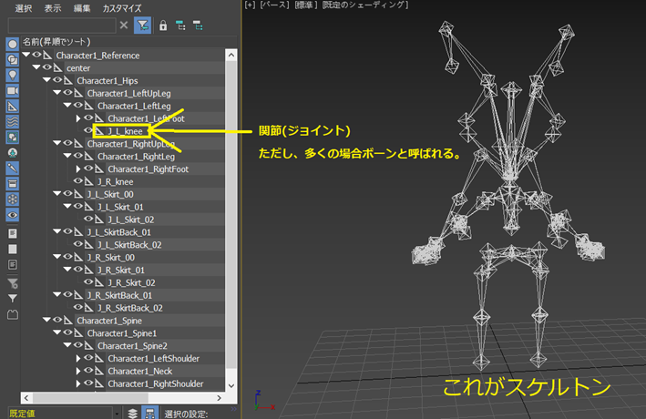

<!-- @import "[TOC]" {cmd="toc" depthFrom=1 depthTo=6 orderedList=false} -->

<!-- code_chunk_output -->

- [Chapter 1 レンダリングパイプライン入門](#chapter-1-レンダリングパイプライン入門)
	- [1.1 CPUとGPU](#11-cpuとgpu)
		- [1.1.1 コア](#111-コア)
		- [1.1.3 まとめ](#113-まとめ)
	- [1.2 メインメモリとグラフィックメモリ](#12-メインメモリとグラフィックメモリ)
		- [1.2.1 メモリ転送](#121-メモリ転送)
		- [1.2.2 なぜメモリが分かれているの？](#122-なぜメモリが分かれているの)
		- [1.2.3 ユニファイドメモリアーキテクチャ](#123-ユニファイドメモリアーキテクチャ)
		- [1.2.4 まとめ](#124-まとめ)
	- [1.3 絵が表示されるまで](#13-絵が表示されるまで)
		- [1.3.1 ドローコール](#131-ドローコール)
		- [1.3.2 レンダリングパイプライン](#132-レンダリングパイプライン)
		- [1.3.3 入力アセンブラ](#133-入力アセンブラ)
		- [1.3.4 頂点シェーダー](#134-頂点シェーダー)
		- [1.3.5 ラスタライザ](#135-ラスタライザ)
			- [塗りつぶし設定](#塗りつぶし設定)
			- [カリング設定(塗りつぶしなし設定)](#カリング設定塗りつぶしなし設定)
		- [1.3.6 ピクセルシェーダー](#136-ピクセルシェーダー)
		- [1.3.7 まとめ](#137-まとめ)
	- [評価テスト-1](#評価テスト-1)
- [Chapter 2 シェーダー入門 その１](#chapter-2-シェーダー入門-その１)
	- [2.1 DirectX7以前のレンダリングパイプライン](#21-directx7以前のレンダリングパイプライン)
	- [2.2 シェーダー](#22-シェーダー)
	- [2.3 なぜシェーダーが生まれたのか](#23-なぜシェーダーが生まれたのか)
	- [2.4 頂点シェーダー入門](#24-頂点シェーダー入門)
		- [2.4.1 ウィンドウズプログラムのメイン関数](#241-ウィンドウズプログラムのメイン関数)
		- [2.4.2 三角形を表示するための準備](#242-三角形を表示するための準備)
		- [2.4.3 三角形を表示するためのドローコール](#243-三角形を表示するためのドローコール)
		- [2.4.4 頂点シェーダー](#244-頂点シェーダー)
		- [2.4.5 【ハンズオン】入力された頂点座標をそのまま出力に渡す](#245-ハンズオン入力された頂点座標をそのまま出力に渡す)
		- [2.4.6 【ハンズオン】入力された頂点座標を拡大して出力に渡す](#246-ハンズオン入力された頂点座標を拡大して出力に渡す)
		- [2.4.7 【課題】入力されたX座標を1.5倍、Y座標を0.5倍して出力に渡す](#247-課題入力されたx座標を15倍y座標を05倍して出力に渡す)
		- [2.4.8 入力頂点構造体](#248-入力頂点構造体)
			- [HLSLの組み込み型](#hlslの組み込み型)
			- [セマンティクス](#セマンティクス)
		- [2.4.9 出力頂点構造体](#249-出力頂点構造体)
			- [セマンティクス](#セマンティクス-1)
		- [2.4.10 まとめ](#2410-まとめ)
	- [評価テスト-2](#評価テスト-2)
	- [2.5 ピクセルシェーダー入門](#25-ピクセルシェーダー入門)
		- [2.5.1 【ハンズオン】三角形を青色にする](#251-ハンズオン三角形を青色にする)
		- [2.5.2 【ハンズオン】三角形を緑色にする](#252-ハンズオン三角形を緑色にする)
		- [2.5.3 ピクセルシェーダーの戻り値は光の三原色＋α](#253-ピクセルシェーダーの戻り値は光の三原色α)
		- [2.5.4【課題】三角形を黄色にする](#254課題三角形を黄色にする)
		- [2.5.5 頂点シェーダーからピクセルシェーダーに渡されるデータ](#255-頂点シェーダーからピクセルシェーダーに渡されるデータ)
		- [2.5.6 【ハンズオン】頂点シェーダーから受け取ったカラーを出力する](#256-ハンズオン頂点シェーダーから受け取ったカラーを出力する)
		- [2.5.7 まとめ](#257-まとめ)
	- [評価テスト-3](#評価テスト-3)
- [Chapter 3 シェーダー入門 その２](#chapter-3-シェーダー入門-その２)
	- [3.1 座標変換](#31-座標変換)
		- [3.1.1 行列とベクトルの乗算](#311-行列とベクトルの乗算)
		- [3.1.2 ワールド行列](#312-ワールド行列)
		- [3.1.3 カメラ行列](#313-カメラ行列)
		- [3.1.4 透視変換行列](#314-透視変換行列)
		- [3.1.5 行列を作るのはCPU？GPU？どっち？](#315-行列を作るのはcpugpuどっち)
		- [3.1.6 メモリ転送](#316-メモリ転送)
			- [定数バッファ](#定数バッファ)
			- [ディスクリプタヒープ](#ディスクリプタヒープ)
		- [3.1.7 【ハンズオン】ワールド行列を作成して三角形を動かしてみよう](#317-ハンズオンワールド行列を作成して三角形を動かしてみよう)
			- [step-1 定数バッファを作成(C++)](#step-1-定数バッファを作成c)
			- [step-2 ディスクリプタヒープを作成(C++)](#step-2-ディスクリプタヒープを作成c)
			- [step-3 ワールド行列を作成(C++)](#step-3-ワールド行列を作成c)
			- [step-4 ワールド行列をグラフィックメモリにコピー(C++)](#step-4-ワールド行列をグラフィックメモリにコピーc)
			- [step-5 ディスクリプタヒープを設定(C++)](#step-5-ディスクリプタヒープを設定c)
			- [step-6 レジスタb0のデータにアクセスするための変数を定義する(HLSL)](#step-6-レジスタb0のデータにアクセスするための変数を定義するhlsl)
			- [step-7 ワールド行列と座標を乗算して座標変換を行う(HLSL)](#step-7-ワールド行列と座標を乗算して座標変換を行うhlsl)
	- [評価テスト-4](#評価テスト-4)
	- [実習課題-1](#実習課題-1)
	- [実習課題-2](#実習課題-2)
	- [実習課題-3](#実習課題-3)
	- [実習課題-4（ハンズオン）](#実習課題-4ハンズオン)
		- [コントローラーの入力で三角形を左右に動かす。](#コントローラーの入力で三角形を左右に動かす)
			- [step-1 平行移動行列を送るための定数バッファを作成。](#step-1-平行移動行列を送るための定数バッファを作成)
			- [step-2 定数バッファをディスクリプタヒープに登録。](#step-2-定数バッファをディスクリプタヒープに登録)
			- [step-3 三角形の座標を表す変数を定義する。](#step-3-三角形の座標を表す変数を定義する)
			- [step-4 コントローラーの入力で三角形を動かす。](#step-4-コントローラーの入力で三角形を動かす)
			- [step-5 三角形の座標を使って平行移動行列を作成する。](#step-5-三角形の座標を使って平行移動行列を作成する)
			- [step-6 定数バッファに平行移動行列をコピーする。](#step-6-定数バッファに平行移動行列をコピーする)
			- [step-7 レジスタb0のデータにアクセスするための変数を定義する。](#step-7-レジスタb0のデータにアクセスするための変数を定義する)
			- [step-8 平行移動行列と座標を乗算して座標変換を行う。](#step-8-平行移動行列と座標を乗算して座標変換を行う)
	- [実習課題-5](#実習課題-5)
	- [実習課題-6](#実習課題-6)
	- [実習課題-7](#実習課題-7)
	- [3.2 テクスチャマッピング](#32-テクスチャマッピング)
		- [3.2.1 テクスチャとは](#321-テクスチャとは)
		- [3.2.2 UV座標](#322-uv座標)
		- [3.2.3 頂点UV座標](#323-頂点uv座標)
		- [3.2.4 テクスチャはグラフィックメモリ？メインメモリ？どっちに載る？](#324-テクスチャはグラフィックメモリメインメモリどっちに載る)
		- [3.2.5 【ハンズオン】三角形にテクスチャを貼る。](#325-ハンズオン三角形にテクスチャを貼る)
			- [step-1 三角形ポリゴンにUV座標を設定。](#step-1-三角形ポリゴンにuv座標を設定)
			- [step-2 テクスチャをロード（C++）](#step-2-テクスチャをロードc)
			- [step-3 テクスチャをディスクリプタヒープに登録（C++）](#step-3-テクスチャをディスクリプタヒープに登録c)
			- [step-4 t0レジスタに設定されているテクスチャにアクセスするための変数を追加する（HLSL）](#step-4-t0レジスタに設定されているテクスチャにアクセスするための変数を追加するhlsl)
			- [step-4 テクスチャカラーをサンプリングして返す。](#step-4-テクスチャカラーをサンプリングして返す)
	- [評価テスト-5](#評価テスト-5)
	- [実習課題-8](#実習課題-8)
	- [実習課題-9](#実習課題-9)
	- [実習課題-10](#実習課題-10)
- [Optional 1 3Dモデル表示](#optional-1-3dモデル表示)
	- [Opt 1.1 概要](#opt-11-概要)
	- [Opt 1.2 Modelクラス](#opt-12-modelクラス)
	- [【ハンズオン】3Dモデルを表示する処理を記述する。](#ハンズオン3dモデルを表示する処理を記述する)
		- [step-1 3Dモデルをロードする。](#step-1-3dモデルをロードする)
			- [step-2 3Dモデルをドローする。](#step-2-3dモデルをドローする)
		- [step-4 コントローラーの入力でキャラを動かす。](#step-4-コントローラーの入力でキャラを動かす)
		- [step-5 コントローラーの入力でキャラをY軸周りに回転させる。](#step-5-コントローラーの入力でキャラをy軸周りに回転させる)
		- [step-6 コントローラーの入力でキャラをX軸方向に拡大させる。](#step-6-コントローラーの入力でキャラをx軸方向に拡大させる)
		- [step-7 平行移動、回転、拡大率を利用してワールド行列を計算する。](#step-7-平行移動回転拡大率を利用してワールド行列を計算する)
- [Chapter 4 ライティング基礎](#chapter-4-ライティング基礎)
	- [4.1 【ハンズオン】ライティングなしの3Dモデル表示](#41-ハンズオンライティングなしの3dモデル表示)
		- [step-1 3Dモデルをロードするための情報を設定する。](#step-1-3dモデルをロードするための情報を設定する)
		- [step-2 初期化情報を使ってモデル表示処理を初期化する。](#step-2-初期化情報を使ってモデル表示処理を初期化する)
		- [step-3 モデルのドローコールを実行する。](#step-3-モデルのドローコールを実行する)
		- [step-4 テクスチャを貼り付ける。](#step-4-テクスチャを貼り付ける)
	- [4.2 ライトの種類](#42-ライトの種類)
		- [4.2.1 ディレクションライト](#421-ディレクションライト)
		- [4.2.2 ポイントライト](#422-ポイントライト)
		- [4.2.3 スポットライト](#423-スポットライト)
	- [評価テスト-6](#評価テスト-6)
	- [4.3 Phongの反射モデル](#43-phongの反射モデル)
		- [4.3.1 拡散反射光](#431-拡散反射光)
			- [内積の性質](#内積の性質)
		- [4.3.2【ハンズオン】ランバート拡散反射を実装](#432ハンズオンランバート拡散反射を実装)
			- [step-1 ディレクションライト用の構造体を定義する。](#step-1-ディレクションライト用の構造体を定義する)
			- [step-2 ディレクションライトのデータを作成する。](#step-2-ディレクションライトのデータを作成する)
			- [step-3 モデルを初期化。](#step-3-モデルを初期化)
			- [step-4 モデルをドロー。](#step-4-モデルをドロー)
			- [step-5 ディレクションライトのデータを受け取るための定数バッファを用意する。](#step-5-ディレクションライトのデータを受け取るための定数バッファを用意する)
			- [step-6 頂点法線をピクセルシェーダーに渡す。](#step-6-頂点法線をピクセルシェーダーに渡す)
			- [step-7 ピクセルの法線とライトの方向の内積を計算する。](#step-7-ピクセルの法線とライトの方向の内積を計算する)
			- [step-8 内積の結果が0以下なら0にする](#step-8-内積の結果が0以下なら0にする)
			- [step-9 ピクセルが受けているライトの光を求める。](#step-9-ピクセルが受けているライトの光を求める)
			- [step-10 最終出力カラーに光を乗算する。](#step-10-最終出力カラーに光を乗算する)
	- [評価テスト-7](#評価テスト-7)
		- [4.3.3 鏡面反射光](#433-鏡面反射光)
			- [1. ライトがサーフェイスに入射して反射したベクトルを求める。](#1-ライトがサーフェイスに入射して反射したベクトルを求める)
			- [2. 光が入射したサーフェイスから視点に向かって伸びるベクトルを求める。](#2-光が入射したサーフェイスから視点に向かって伸びるベクトルを求める)
			- [3. 1と2で求めたベクトルの内積を使って鏡面反射の強さ(オリジナル)を求める。](#3-1と2で求めたベクトルの内積を使って鏡面反射の強さオリジナルを求める)
			- [4. 3で求めた鏡面反射の強さを絞って、最終的な鏡面反射の強さを求める。](#4-3で求めた鏡面反射の強さを絞って最終的な鏡面反射の強さを求める)
		- [4.3.4【ハンズオン】フォン鏡面反射を実装しよう](#434ハンズオンフォン鏡面反射を実装しよう)
			- [step-1 構造体のメンバに視点の位置を追加する。](#step-1-構造体のメンバに視点の位置を追加する)
			- [step-2 視点の位置を設定する。](#step-2-視点の位置を設定する)
			- [step-3 視点のデータにアクセスするための変数を定数バッファに追加する。](#step-3-視点のデータにアクセスするための変数を定数バッファに追加する)
			- [step-4 反射ベクトルを求める。](#step-4-反射ベクトルを求める)
			- [step-5 光が当たったサーフェイスから視点に伸びるベクトルを求める。](#step-5-光が当たったサーフェイスから視点に伸びるベクトルを求める)
			- [step-6 鏡面反射の強さを求める。](#step-6-鏡面反射の強さを求める)
			- [step-7 鏡面反射の強さを絞る。](#step-7-鏡面反射の強さを絞る)
			- [step-8 鏡面反射光を求める。](#step-8-鏡面反射光を求める)
			- [step-9 拡散反射光と鏡面反射光を足し算して、最終的な光を求める。](#step-9-拡散反射光と鏡面反射光を足し算して最終的な光を求める)
			- [step-10 テクスチャカラーに求めた光を乗算して最終出力カラーを求める。](#step-10-テクスチャカラーに求めた光を乗算して最終出力カラーを求める)
	- [評価テスト-8](#評価テスト-8)
		- [4.3.5 環境光](#435-環境光)
		- [4.3.6 【ハンズオン】環境光を実装しよう。](#436-ハンズオン環境光を実装しよう)
			- [step-1 ライトの効果を一律で底上げする。](#step-1-ライトの効果を一律で底上げする)
		- [4.3.7 Phongの反射モデルまとめ](#437-phongの反射モデルまとめ)
	- [評価テスト-9](#評価テスト-9)
- [Optional_2 カメラの基礎](#optional_2-カメラの基礎)
	- [Optional_2.1 カメラ行列](#optional_21-カメラ行列)
		- [Optional_2.1.1 注視点、視点、カメラの上方向](#optional_211-注視点視点カメラの上方向)
		- [Optional_2.1.2 カメラ行列を作成する関数](#optional_212-カメラ行列を作成する関数)
		- [【ハンズオン】カメラを動かしてみよう。](#ハンズオンカメラを動かしてみよう)
			- [step-1 キー入力でカメラの注視点を左右に動かす。](#step-1-キー入力でカメラの注視点を左右に動かす)
			- [step-2 キー入力でカメラの注視点を左右に動かす。](#step-2-キー入力でカメラの注視点を左右に動かす)
			- [カメラは行列を計算しているのはどこ？](#カメラは行列を計算しているのはどこ)
			- [ワールド座標系の頂点にカメラ行列を乗算してカメラ座標系に変換しているのはどこ？](#ワールド座標系の頂点にカメラ行列を乗算してカメラ座標系に変換しているのはどこ)
	- [評価テスト-10](#評価テスト-10)
	- [Optional_2.2 三人称カメラ](#optional_22-三人称カメラ)
		- [Optional_2.2.1 プレイヤーを追従](#optional_221-プレイヤーを追従)
		- [Optional_2.2.2【ハンズオン】プレイヤーを追従するカメラ](#optional_222ハンズオンプレイヤーを追従するカメラ)
		- [Optional_2.2.3 カメラの回転](#optional_223-カメラの回転)
			- [Y軸周りの回転](#y軸周りの回転)
		- [Optional_2.2.4【ハンズオン】コントローラーの入力でY軸周りに回転するカメラを作成する。](#optional_224ハンズオンコントローラーの入力でy軸周りに回転するカメラを作成する)
		- [X軸周りの回転](#x軸周りの回転)
		- [Optional_2.2.5【ハンズオン】コントローラーの入力でX軸周りに回転するカメラを作成する。](#optional_225ハンズオンコントローラーの入力でx軸周りに回転するカメラを作成する)
	- [評価テスト-11](#評価テスト-11)
	- [Optional_2.3 カメラを考慮したキャラクターの移動](#optional_23-カメラを考慮したキャラクターの移動)
		- [Optional_2.3.1 カメラの方向に移動させる](#optional_231-カメラの方向に移動させる)
		- [Optional_2.3.2 【ハンズオン】ティーポットをカメラの前方向に動かす。](#optional_232-ハンズオンティーポットをカメラの前方向に動かす)
			- [step-1 カメラの前ベクトルを求める。](#step-1-カメラの前ベクトルを求める)
		- [step-2 カメラの前方向を使って、ティーポットの座標を動かす。](#step-2-カメラの前方向を使ってティーポットの座標を動かす)
		- [step-3 ティーポットのワールド行列を更新する。](#step-3-ティーポットのワールド行列を更新する)
		- [Optional_2.3.3 XZ平面での移動](#optional_233-xz平面での移動)
		- [Optional_2.3.4 【課題】ティーポットをカメラのXZ平面での前方向に動かす。(時間 10分)](#optional_234-課題ティーポットをカメラのxz平面での前方向に動かす時間-10分)
		- [Optional_2.3.5 カメラを考慮した左右の移動](#optional_235-カメラを考慮した左右の移動)
		- [Optional_2.3.6 【ハンズオン】ティーポットをカメラの左右方向に動かす。](#optional_236-ハンズオンティーポットをカメラの左右方向に動かす)
			- [step-1 カメラの横ベクトルを求める。](#step-1-カメラの横ベクトルを求める)
			- [step-2 カメラの横ベクトルを使ってティーポットの座標を動かす。](#step-2-カメラの横ベクトルを使ってティーポットの座標を動かす)
		- [Optional_2.3.6 アナログスティックを利用したキャラクターの移動](#optional_236-アナログスティックを利用したキャラクターの移動)
		- [Optional_2.3.7 【ハンズオン】アナログスティックを利用した移動処理を実装する。](#optional_237-ハンズオンアナログスティックを利用した移動処理を実装する)
	- [評価テスト-12](#評価テスト-12)
- [Optional_3 アニメーションの基礎](#optional_3-アニメーションの基礎)
	- [Optional_3.1 モーフィング](#optional_31-モーフィング)
	- [Optional_3.2 プロシージャルアニメーション](#optional_32-プロシージャルアニメーション)
	- [Optional_3.3 スケルトンアニメーション](#optional_33-スケルトンアニメーション)
		- [Optional_3.3.1 スケルトン](#optional_331-スケルトン)
		- [Optional_3.3.2 アニメーションクリップ](#optional_332-アニメーションクリップ)
			- [アニメーションを再生](#アニメーションを再生)
	- [評価テスト-13](#評価テスト-13)

<!-- /code_chunk_output -->


<!-- /code_chunk_output -->

<!-- 改ページ. -->
<div style="page-break-before:always"></div>

# Chapter 1 レンダリングパイプライン入門
<lead>
このチャプターではCPUとGPUについて学び、画面に3Dモデルの絵が表示されるまでの流れを学びます。
</lead>

## 1.1 CPUとGPU
&emsp;CPUはゲームの進行を司る司令塔のようなものです。ゲームのキャラクターに「Aボタンが押されたらジャンプしなさい」や「Bボタンが押されたらダッシュしなさい」といった指示を出します。一方GPUはCPUからの指示で画面に絵を描く部下のようなものです。PlayStation(以下PS1)の登場で、3DCGを利用したゲームを家庭で楽しめるようになりました。3DCGを利用したゲームを実現するためには、高速な演算を可能とする必要があります。これを実現するために、PS1にはCPUとは別に高速なベクトル演算基、GPUを搭載していました。PS1以降の家庭用ゲーム機は3DCGのゲームを制作できるようにCPUとGPUを搭載するようになってきました。 
### 1.1.1 コア 
&emsp;CPUとGPUには計算を行う「コア」と呼ばれるものが搭載されています。さて、先ほどの説明の「GPUは高速な演算が可能」という説明と矛盾して聞こえると思いますが、CPUのコアは非常に高速な計算が可能です。一方、GPUのコアはそれほど計算は速くはありません。ですが、GPUはCPUに比べるとシンプルな設計になっているため、大量に用意することができます。一方CPUは複雑な処理を行う必要があるため、コアが高価になり、大量に用意することができません。intelのcore-i7というCPUのコア数が8個なのに対して、NVIDIAのRTX1080というGPUのコア数はは2560個です。</br>

&emsp;3DCGを利用したゲームでは、大量の演算が行われます。例えば、100万頂点の3Dモデルをディスプレイに表示するためには、全ての頂点をディスプレイ空間に変換するための演算が行われます。</br></br>
</br></br>
&emsp;その他にもディスプレイのピクセルのカラーを決定するための計算も必要です。ディスプレイ(正確にはレンダリングターゲット)の解像度が縦1920、横1080の場合、ピクセルの数は1920×1080の約200万ピクセルになります。この全てのピクセルのカラーを計算する必要があるわけです。</br></br>
</br>
&emsp;3Dモデルを画面に表示するためには、大量の単純計算が必要になります。例えば、これをC++言語で記述すると下記のようになります。</br>
```cpp
//100万個の頂点の座標変換を行う。
Vector4 convertedVertex[1000000];
for( int vertexNo = 0; vertexNo < 1000000; vertexNo++)
{
    convertedVertex[vertexNo] = worldMatrix * vertex[vertexNo];
    convertedVertex[vertexNo] = viewMatrix * convertedVertex[vertexNo];
    convertedVertex[vertexNo] = projMatrix * convertedVertex[vertexNo];
}
    
```
&emsp;プログラムの意味は分からなくても構いません。注目してほしいのは、100万個の頂点に対して計算を行っているということです。この計算をあなたが行うことを想像してみてください。とてつもない時間がかかることが容易に想像できます。ですが、もしもこの計算を100万人で分担したらどうなるでしょう？１人で計算をしたときよりも、驚くほど短時間で計算が完了します。これがCPUとGPUの関係になります。</br>
</br>
&emsp;CPUはとても計算も速く、複雑な仕事ができます。しかし、高性能であるゆえに高価であり、大量に用意することはできません。一方GPUは計算が遅く、単純な仕事しかできません。しかし、低性能であるがゆえ、安価であり、大量に用意することができます。そこで、単純だが、量が多い計算をGPUにお願いすることで、CPU１人で計算するよりも、圧倒的に高速に計算を完了させることができるようになります。そして、これに非常に適している処理が、3DCGのレンダリングだったのです。
<!-- 改ページ. -->
<div style="page-break-before:always"></div>

### 1.1.3 まとめ
1. **CPUは司令塔、GPUは絵を描くことに特化したアーティスト**</br>
CPUは複雑な処理をこなすことができる司令塔です。GPUは複雑な処理は苦手ですが、絵を描くという一芸に秀でたアーティストです。
2. **GPUは大量の単純計算を行うことが得意**</br>
GPUは単一コアの計算速度はCPUよりも劣るが、コアを大量に持っているため、単純な計算を並列に行うことが可能となっており、ケースによってはCPUよりも高速に演算を行うことができる。
3. **3DCGをレンダリングするためには、大量の演算を行う必要がある**</br>
3DCGを画面にレンダリングするためには、頂点座標の変換や、ピクセルカラーの決定という大量の演算を行う必要がある。

## 1.2 メインメモリとグラフィックメモリ
&emsp;前節で見てきた、CPUとGPUは人間で例えると脳みそに当たります。コンピューターに指示を出したり、計算を行ったりします。しかし、人間の脳みそと大きく異なる点があります。それは記憶することができないということです。このモノを覚えるという機能を持っているのが、メモリと呼ばれるものです。</br>
&emsp;CPUとGPUは別人なので、脳みそが別々です。人間が２人いるようなものだと考えてください。２人いるので、当然記憶も別物になります。メインメモリにはゲームのキャラクターの体力、攻撃力、守備力といったゲームを制御するためのデータが記憶されています。一方グラフィックメモリには3DCGをレンダリングするために必要なデータが記録されています。具体的には、3Dモデルの頂点データとなる頂点バッファ、模様を表すテクスチャなどです。</br>
<p align="center">
</br>
</p>
&emsp;CPUとGPUは別人なので、脳みそは別物です。ですので、CPUからアクセスできるメモリはメインメモリ、GPUからアクセスできるメモリはグラフィックメモリとなります。基本的にCPUからグラフィックメモリにアクセスしたり、GPUからメインメモリにアクセスしたりすることは、シンプルなプログラミングで行うことはできません。

```cpp
//プレイヤーの体力を表示。
//このデータはメインメモリに記憶されているので、簡単にアクセスできる。
prntf("%d", playerHp); 

//しかし、下記のようにテクスチャはグラフィックメモリに記録されているので、
//このように、直接アクセスして、画素を変更するようなことは簡単には行えない。
/*texture[0].r = 232;
texture[0].g = 104;
texture[0].b = 110;*/
```
### 1.2.1 メモリ転送
&emsp;この後のチャプターで具体的にシェーダープログラミングを行っていくと分かってくるのですが、実はCPUとGPUとでメモリが分かれていることで困ることが出てきます。具体的には、GPUからメインメモリのデータに対してアクセスしたいケースがたくさん出てくるからです。しかし、GPUからアクセスできるのはグラフィックメモリだけです。ですので、CPUはGPUのDMA(Direct Memory Access)コントローラーなどを利用して、メインメモリの内容をグラフィックメモリにコピーします。例えば、3Dモデルの頂点データやテクスチャなどはメインメモリに一旦ロードされることがほとんどです。ですので、これらのデータをグラフィックメモリにコピーしてやる必要があります。下記のコードはDirectX12のAPIを利用して、メインメモリからグラフィックメモリにデータをコピーするコードです。

```cpp
ID3D12Device* d3dDevice = g_graphicsEngine.GetD3DDevice();
//DirectXTKのResourceUpdateBatchクラスを利用して、
//頂点バッファをグラフィックメモリにコピーする。
DirectX::ResourceUploadBatch re(d3dDevice.Get());
re.Begin();
//コピーするリソースの情報を設定。
D3D12_SUBRESOURCE_DATA subResourceData;
subResourceData.pData = srcVertices; //頂点バッファの先頭アドレス。  
subResourceData.RowPitch = m_vertexBufferView.SizeInBytes; //コピーするデータのサイズ。
subResourceData.SlicePitch = 1;
//コピーを実行。
re.Upload(
	m_vertexBuffer.Get(),
	0,
	&subResourceData,
	1);
re.End(ge12.GetCommandQueue().Get());
```

GPUからメインメモリのデータが必要な例では、そのほかにも、下記のようなプレイヤーの体力に応じて画面が赤くなるような表現があります。</br>
<p align="center">
<!-- webから引っ張ってきた画像です。使用してOKな画像に差し替えをお願いします。. -->
</img></br>
</p>
このような表現を行うためには、GPUはメインメモリに記憶されている、プレイヤーの残り体力にアクセスしないと行うことはできません。しかし、GPUがアクセスできるのはグラフィックメモリだけです。ですので、DMAコントローラーなどを利用してメインメモリの内容をグラフィックメモリにコピーする仕組みが必要になるのです。

### 1.2.2 なぜメモリが分かれているの？
&emsp;さて、なぜCPUとGPUとでメモリが分かれているのでしょうか？もしもCPUとGPUでメモリが共通であれば、あんな複雑なプログラムを書く必要はなくなります。端的に理由を説明すると、「CPUとGPUとで最高性能を求めると、メモリ要件が異なってくるから」というものになります。メインメモリはゲーム以外の用途でも利用されます。そのため、汎用性の高く、複雑な要件が求められます。例えば、メモリに載らなくなったデータをハードディスクに退避させる仕組みや、ユーザーが自由にメモリを増設できる仕組みなどです。一方グラフィックメモリはグラフィックに関する用途でしか利用されません。そして、求められる要件も「とにかく高速にデータの転送を行えるようにしてほしい」というシンプルなものです。GPUは大量の演算を行います。その時に演算に必要なデータ、頂点データ、テクスチャ、インデックス情報などを大量にメモリからロードする必要があります。そのため、グラフィックメモリは拡張性や汎用性を無視してもいいが、高速にデータを転送することができる必要があるわけです。このように、CPUとGPUとで求められる要件が異なっているため、メモリが分かれています。</br></br>
</img></br>

下記は、私が使っているPCのメモリのスペック表です。メインメモリはDDR4、グラフィックメモリはGDDR5になっています。データを読み込む速度の指標となるメモリ帯域が、メインメモリは42.7GB/sであるのに対して、グラフィックメモリは192.2GB/sと約4.5倍の速度になっています。
</br>

### 1.2.3 ユニファイドメモリアーキテクチャ
&emsp;ここまで、CPUとGPUとでメモリは分かれていているものだと説明してきました。しかし、分かれていることによりプログラムは複雑になり読みにくくなってしまいます。CPUとGPUのメモリを統合してしまえば、プログラムはシンプルになるのですが、1.2.2で説明したように、CPUとGPUとで最高性能を求めると、メモリに求める要件というものが異なってくるため、ハードウェア的に統合することは難しいのが現実です。そこで、ソフトウェア的に、プログラマーから見た場合はあたかもメモリが統一されているかのように振る舞うことができる、ユニファイドメモリアーキテクチャが登場しました。</br>
<p align="center">
</img></br>
</p>
このアーキテクチャでは仮想メモリという偽物のメモリを用意しています。CPUとGPUはこの仮想メモリにアクセスします。そして、ハードウェアがアクセスしているメモリに応じて、適切な物理メモリ、本物のメモリにアクセスしています。この仕組みによって、プログラマーから見るとGPUもCPUも同じメモリにアクセスしているようにプログラムを記述することができます。つまり、ユニファイドメモリアーキテクチャであれば、1.2.1のメモリ転送の項目で記述した、頂点バッファのデータコピーは下記のようにシンプルに書けるようになるわけです。

```cpp
//頂点バッファの内容をグラフィックメモリにコピー。
memcpy(m_vertexBuffer, srcVertices, vertexBufferSize);
```
しかし、DirectX12では、基本的にメモリは分かれている前提でのプログラミングを行うようになっています。</br>
<!-- 改ページ. -->
<div style="page-break-before:always"></div>

>Intel HD Graphicsなどのcpuに統合されているGPUでは、グラフィックメモリというものは用意されておらず、CPUが使用しているメインメモリの一部を使用するような形になります。そのため、統合プロサッサは真のユニファイドメモリアーキテクチャといえるのですが、メモリ帯域が足りない、メモリの容量も足りないと言った問題を抱えてしまうため、パフォーマンスの面ではどうしても単体のGPUに劣ってしまいます。
>

### 1.2.4 まとめ
1. **CPUとGPUとでメモリは物理的に分かれている**</br>
CPUとGPUとで最高性能を求めると、メモリ要件が異なってくるため、メモリが別々になっています。
2. **基本的にCPUはメインメモリ、GPUはグラフィックメモリにしかアクセスできない**</br>
これは、後々シェーダープログラミングを行っていくときに重要になってくるので、しっかりと押さえておいてください。
3. **メインメモリ→グラフィックメモリ、グラフィックメモリ→メインメモリにデータを転送する仕組みが必要**</br>
これも2と同様に、後々重要になってきます。

## 1.3 絵が表示されるまで
　ここまでCPUとGPU、メインメモリとグラフィックメモリについて学んできました。3DCGを画面に表示するためには、絵を描きなさい！と命令を出す司令塔のCPUと絵を描くことに特化したアーティストのGPUの二つのプロセッサが存在していることを学びました。では、もう少し具体的に、最終的に絵が出るまでどのような流れになっているのかを見ていきましょう。

### 1.3.1 ドローコール
&emsp;絵を描くためにはGPUに対して絵を描きなさい！と命令を出す必要があります。この命令はドローコールと呼ばれます。Unityなどでゲームを作ったことがある方なら聞いたことがあるのではないかと思います。「処理を早くするためにはドローコールを減らしなさい」と言われているのを聞いたことがあるのではないでしょうか。このドローコールの最適化に関しては、最適化のチャプターで詳しく説明します。</br>
&emsp;さて、少しGPUの気持ちになって考えてみてください。あなたは「絵を描きなさい！」と命令されました。さてどんな絵を描けばいいのでしょうか？かわいい女の子のキャラクターを描けばいいのでしょうか？もしくは、カッコいい男の子のキャラクター、ひょっとすると可愛らしいゆるキャラかもしれません。「絵を描きなさい！」という命令だけでは、どんな絵を描けばいいのか分かりませんよね？なので、ドローコールを行う前に、どんな絵を描くのか？といった情報もGPUに教えてやる必要があります。下記のコードは犬の3Dモデルを描くためにドローコールを行う疑似コードです。
```cpp
//犬のモデルの頂点バッファを設定する。
SetVertexBuffer( dogVertexBuffer );
//犬のモデルのテクスチャを設定する。
SetTexture( dogTexture ) ;
//ここまでに設定した内容でドローコールを実行。
Draw();
```
このコードはあくまでも疑似コードなので、実際のコードはここまでシンプルではありませんが、ドローコールに必要な情報を端的に表しています。3Dモデルの絵を描いてもらうためには、頂点座標、模様を表すテクスチャなどが必要になります。このドローコールが実行されるとGPUは絵を描きだすわけです。

### 1.3.2 レンダリングパイプライン
&emsp;CPUからドローコールが実行されると、そこからGPUは絵を描き始めるわけです。この時、GPUは決められた手順で絵を描いていきます。この絵を描くための手順がレンダリングパイプラインと呼ばれています。例えば、あなたが絵を描くときは下記のような手順を踏むのではないでしょうか。
1. キャンパスを用意する。
2. 鉛筆を用意する。
3. 鉛筆を使って下書きを行う。
4. 絵具を用意する。
5. 絵具を使って絵を仕上げる。

&emsp;これと同じように、GPUも画面に絵を表示するまでの決められた手順というものがあります。これがレンダリングパイプラインと呼ばれているものです。この手順は近年、非常に複雑になってきているのですが、ここでは手順を必要最小限にして説明にとどめておきます。さらに詳しい話は、Chpater8のレンダリングパイプライン発展で説明します。
<div style="page-break-before:always"></div>

1. 入力アセンブラ : グラフィックメモリから設定されている頂点バッファ、インデックスバッファなどをロードする 。
<p align="center">
</img></br>
</p>

2. 頂点シェーダー : 頂点データをスクリーン空間に変換する。</br>
<p align="center">
</img></br>
</p>

3. ラスタライザ : 絵を描くために塗りつぶす必要があるピクセルを決定する。</br>
<p align="center">
</img></br>
</p>

4. ピクセルシェーダー : ピクセルのカラーを決定する。</br>
<p align="center">
</img></br>
</p>

&emsp;これらがGPUが行う仕事、レンダリングパイプラインを簡単に説明したものです。まず、**入力アセンブラ**は絵を描くために必要な頂点バッファやインデックスバッファと呼ばれるデータを準備します。続いて、**頂点シェーダー**で頂点座標にワールド行列、ビュー行列、プロジェクション行列を乗算して、スクリーン空間に変換します。スクリーン空間に変換できたら、**ラスタライザ**で絵を表示するために塗りつぶす必要があるピクセルを決定します。最後に**ピクセルシェーダー**で陰影の計算などを行ってピクセルカラーを決定してピクセルを塗りつぶしていきます。
&emsp;これらの仕事はステージと呼ばれます。この中で、頂点シェーダーとピクセルシェーダーは、プラグラマが自由にプログラミングできるステージとなっており、非常に高い柔軟性を持っています。一方ラスタライザや入力アセンブラは、ある程度固定化されたステージで、プログラマが自由にプログラミングすることはできません。これらのステージについてまとめたものが表1.3.1です。
</br>

**表1.3.1**
|  ステージ名  |　説明　|　柔軟性  |
| ---- | ---- | ---- |
|  入力アセンブラ  |　データの準備　|  低い  |
|  頂点シェーダー  |  座標変換　|  高い  |
|  ラスタライザ  |  塗りつぶすピクセルの決定  |  低い  |
|  ピクセルシェーダー  |  ピクセルカラーの計算　|  高い  |
&emsp;このうち、頂点シェーダーとピクセルシェーダーは本書のメインテーマとなっており、Chapter2以降でさらに詳しく見ていくことにします。

<!-- 改ページ. -->
<div style="page-break-before:always"></div>


### 1.3.3 入力アセンブラ
&emsp;入力アセンブラはCPUからドローコールが実行されると、GPUが真っ先に実行する仕事です。入力アセンブラの仕事は、絵を描くためのデータを準備することです。準備するデータは頂点バッファ、インデックスバッファ、入力レイアウト、プリミティブタイプなどのデータです。ドローコールが実行されると、GPUはグラフィックメモリから必要なデータをレジスタという場所に運んできます。</br>

**[図?.? グラフィックメモリから必要なデータを運んでいる]**

<p align="center">
</img></br>
</p>

**[図?.? 必要なデータをレジスタに運ぶ]**
<p align="center">
</img></br>
</p>

レジスタとは、非常に高速に読み書きができるメモリです。グラフィックメモリはメインメモリに比べて高速だという話をしましたが、レジスタはさらに高速です。ですので、絵を描くときには毎回グラフィックメモリにデータを参照しに行くのではなく、一旦レジスタにデータを運んできて、そこからデータを参照することで処理の高速化を実現しています。
<!-- 改ページ. -->
<div style="page-break-before:always"></div>

### 1.3.4 頂点シェーダー
&emsp;このステージでは、3Dモデルの頂点座標をスクリーン空間に変換します。
<p align="center">
</img></br>
</p>
&emsp;頂点シェーダーはプログラマブルなステージです。つまりプログラミングを行う必要があります。頂点シェーダーの主な仕事は3Dモデルの頂点をスクリーン空間に変換することなので、ほとんどの場合で、下記のような処理を実装します。

1. ローカル座標系の頂点をワールド座標系に変換する。
2. ワールド座標系の頂点をカメラ座標系に変換する。
3. カメラ座標系の頂点をスクリーン座標系に変換する。

処理の詳しい説明はChapter2の頂点シェーダー入門で説明しますので、ここでは簡単にだけ説明しますが、Blender、3dsMax、mayaなどといった3DCGソフトウェアで作成された3Dモデルをテレビ画面など表示するために、それらの頂点をスクリーン空間に変換する必要があります。このときに、ベクトル(座標)と行列の乗算が行われて、座標変換が行われています。ですので、先ほどの1～3ではベクトルと行列の乗算が行われていることになります。

1. ローカル座標系の頂点をワールド座標系に変換する。

    → **ワールド座標系の座標　＝　ローカル座標系の座標　×　ワールド行列**

2. ワールド座標系の頂点をカメラ座標系に変換する。   

    → **カメラ座標系の座標　＝　ワールド座標系の座標　×　カメラ行列**

3. カメラ座標系の頂点をスクリーン座標系に変換する。

    → **スクリーン座標系の座標　＝　カメラ座標系の座標　×　プロジェクション行列**

&emsp;さて、確かにスクリーン空間への座標変換が頂点シェーダーの仕事なのですが、この処理を行うだけであるならば、プログラマブルである必要はありません。プログラマブルであるということは、自由にプログラミングができるわけなので、極端に言えば、必ずしも座標変換する必要はないのです！これについてはChapter2以降で詳しく見ていきます。ここでは、頂点シェーダーというのは、頂点座標をスクリーン空間に変換しているのだと理解しておいてください。

<div style="page-break-before:always"></div>

### 1.3.5 ラスタライザ
&emsp;ラスタライザは頂点シェーダーで座標変換された3Dモデルを画面に表示するために、塗りつぶす必要があるピクセルを決定します。
<p align="center">
</img></br>
</p>
&emsp;ラスタライザは頂点シェーダと違い、プログラマブルではなく、固定的なステージです。ただし、柔軟性が全くないわけではなく、いくつかの設定で処理を変更することができます。例えば下記のような設定があります。

#### 塗りつぶし設定
&emsp;この設定では、ピクセルの塗りつぶし方を変更することができます。DirectX12には2種類の塗りつぶしモードがあり、D3D12_FILL_MODE_WIREFRAMEとD3D12_FILL_MODE_SOLIDがあります。
D3D12_FILL_MODE_WIREFRAMEを設定した場合はワイヤーフレームモードで塗りつぶされます。
</img></br>

D3D12_FILL_MODE_SOLIDを設定した場合は、皆さんのイメージ通りの塗りつぶしが行われます。
</img></br>

#### カリング設定(塗りつぶしなし設定)
&emsp;この設定では、ポリゴンカリングを設定することができ、DirectX12では、D3D12_CULL_MODE_FRONT(ポリゴンの表側をカリング)、D3D12_CULL_MODE_BACK(ポリゴンの裏側をカリング)、D3D12_CULL_MODE_NONE(カリングなし)が設定できます。</br></br>
D3D12_CULL_MODE_FRONTを設定するとポリゴンの表側が塗りつぶされません。</br>
</img></br>

D3D12_CULL_MODE_BACKを設定するとポリゴンの裏側が塗りつぶしされません。</br>
</img></br>

D3D12_CULL_MODE_NONEを設定するとカリングなしになります。</br>
</img></br>
&emsp;D3D12_CULL_MODE_FRONTを指定すると、ポリゴンの表面が表示されなくなるので、異様な見た目になります。D3D12_CULL_MODE_BACKを指定すると、ポリゴンの裏面が表示されなくなるので、普段皆さんが見慣れている見た目になります。D3D12_CULL_MODE_NONEを指定すると、表面も裏面も表示されるので、今回のケースだとD3D12_CULL_MODE_BACKと同じ結果になります。
&emsp;ポリゴンのカリング設定を適切に行うと無駄な処理が行われなくなります。今回のケースですとポリゴンの裏面を描画する必要はないので、D3D12_CULL_MODE_BACKを指定してやればいいわけです。さて、ここで疑問がでてきます。ポリゴンの裏面を描画するケースや、両面描画するケースってあるの？って思いませんでしたか？この疑問については、【todo あとで関連するチャプターを記入する】で取り上げさせてもらいますので、楽しみにしていてください。

### 1.3.6 ピクセルシェーダー
&emsp;ピクセルシェーダーはライスタライザで決定されたピクセルのカラーを決定するステージです。
<p align="center">
</img></br>
</p>
ピクセルシェーダーはプログラマブルなステージです。ピクセルシェーダーは、ありとあらゆるグラフィックスアルゴリズムの中核をなしていて、シェーダープログラミングの花形といえるステージです。もっとも典型的な利用のされ方は、ピクセルの陰影付けです。ピクセルに法線という、向きを表す情報と、ライトの情報を持たせて、陰影を計算していきます。みんなが大好きなセルシェーディングでもピクセルシェーダーが活躍します。詳しくはChapter3以降で見ていきますので、ここではこれくらいにしておきましょう。

### 1.3.7 まとめ
1. 絵を表示するためには、CPUからGPUに対して描画命令(ドローコール)を行う必要がある。
2. 画面に絵を表示するための決められた手順があり、レンダリングパイプラインと呼ばれている。
3. このチャプターでは、入力アセンブラ、頂点シェーダー、ラスタライザ、ピクセルシェーダーを学んだ。
4. 入力アセンブラ：絵を描くために必要なデータを準備する。
5. 頂点シェーダー : 頂点データをスクリーン空間に変換する。
6. ラスタライザ：塗りつぶすピクセルを決定する。
7. ピクセルシェーダー：ピクセルのカラーを決定する。

<!-- 改ページ. -->
<div style="page-break-before:always"></div>

## 評価テスト-1
次の評価テストを行いなさい。</br>
[評価テストへジャンプ](https://docs.google.com/forms/d/e/1FAIpQLSda991rBP21I0Pu9cqDKFrrOyPTtAC7ILvhSLgSdvdUshk5Wg/viewform?usp=sf_link)

<!-- 改ページ. -->
<div style="page-break-before:always"></div>

# Chapter 2 シェーダー入門 その１
&emsp;Chapter1でレンダリングパイプラインについて学びました。このパイプラインには処理ごとにステージ分けされていて、柔軟性が低い、入力アセンブラやラスタライザなどのステージは固定機能ステージと呼ばれています。一方柔軟性が高い、頂点シェーダーやピクセルシェーダーなどのプログラマブルステージと呼ばれています。DirectXでプログラマブルステージが用意されたのはDirectX8以降で、それ以前のバージョンでは固定機能ステージしか用意されていませんでした。表1.3.1で各ステージの柔軟性を見ましたが、表2.1のようにすべてのステージで柔軟性が低いになっていると考えてください。DirectX7以前のバージョンとステージ名は違うのですが、対比させるためにあえて同じにしています。

**表 2.1**
|  ステージ名  |　説明　|　柔軟性  |
| ---- | ---- | ---- |
|  入力アセンブラ  |　データの準備　|  低い  |
|  頂点処理(現在の頂点シェーダーに相当)  |  座標変換　|  低い  |
|  ラスタライザ  |  塗りつぶすピクセルの決定  |  低い  |
|  ピクセル処理(現在のピクセルシェーダーに相当)  |  ピクセルカラーの計算　|  低い  |


&emsp;頂点変換とピクセルカラー決定の固定機能はDirectX9までは存在していましたが、DirectX10で削除され、それ以降は固定機能は用意されなくなっています。これはDirectX以外のグラフィックスAPIの、Valukan、OpenGLES、Sonyや任天堂などが提供する専用SDK(PS4、PS3、WiiUなどで使用できるDirectXのようなもの)でも同じで、頂点変換やピクセルカラー決定の固定機能はグラフィックプログラミングの世界では過去のものとなっています。

## 2.1 DirectX7以前のレンダリングパイプライン
&emsp;では、DirectX7以前のレンダリングパイプラインについて見ていきましょう。以前のレンダリングパイプラインでもCPUでドローコールが実行されることで、GPUは動き出します。図2.1のようにセットされた頂点バッファから頂点をフェッチ(取り出して)して、その頂点の座標をスクリーン座標系に変換して、塗りつぶすピクセルを決定して、そのピクセルの色を決定します。

**図2.1**
</img></br>

DirectX9までは3Dモデルの頂点をスクリーン空間に変換する頂点変換、ラスタライズ後に3Dモデルをスクリーン上で表示するためのピクセルカラーの決定といった処理をGPUがハードウェア的に用意してくれていました。しかし、DirectX10以降では、この機能はハードウェア側で用意されなくなり、プログラマーがプログラミングする必要が出てきました。そして、そのプログラムがシェーダーと呼ばれています。

## 2.2 シェーダー
&emsp;シェーダーの導入でレンダリングパイプラインの頂点処理とピクセル処理を自分でプログラミングして、自由に頂点処理やピクセル処理を実装することができるようになりました。つまり、自分で頂点座標をスクリーン座標系へ変換したり、ピクセルカラーを決定するプログラムを書くことになります。つまりDirectX10以降ではシェーダーを書かないと絵は表示できなくなりました。図2.2はシェーダー導入後のレンダリングパイプラインです。

**図2.2**
</img></br>

&emsp;この図のように、頂点処理とピクセル処理がシェーダーをロードして実行するという内容に変わっています。ではなぜ固定機能が削除されてシェーダーが登場したのでしょうか？せっかく用意されていたものがなくなって、同じものを作らないと絵を表示できなくなったなんて面倒だと思いませんか？では、シェーダーが生まれてきた背景を学んで行きましょう。

## 2.3 なぜシェーダーが生まれたのか
&emsp;固定機能しか存在していなかったDirectX7までは、マイクロソフトが用意したグラフィック表現しか行うことができませんでした。ピクセルカラーの決定で重要な要素としてライティングがあります。DirectX9までに用意されていた陰影計算モデルはディフューズライト、スペキュラライト、アンビエントライトくらいです。これらのライトの詳しい話は後々行うので、ここでは詳しく説明はしませんが、これらのライトで実現可能なグラフィック表現というと、せいぜい図2.3程度のものです。

**図2.3**</br>
</img></br>

&emsp;しかし、これらの機能だけでは、図2.4のようなアニメっぽい表現の実現は困難です。

**図2.4**</br>
</img></br>
&emsp;このようなアニメ調の表現を実現するためには特殊なライティングアルゴリズムを実装する必要があります。しかし、シェーダーが生まれる前は新しいグラフィック表現を実現するためには、DirectXのバージョンアップを待つ必要がありました。また、ゲーム開発者という人たちは、他とは違うユニークな表現を行いたがるものです。その人たちの要望にすべて答えようとすると、DirectXのAPIはどんどん肥大化していくことになります。そこで、DirectXはバージョン8から開発者が行いたい表現をすぐに実現できるように、プログラマブルシェーダーを採用した設計に舵をとることとなります。

## 2.4 頂点シェーダー入門
&emsp;では、いよいよ実際にシェーダーを書いていってみましょう。まずはシンプルな三角形を表示するだけのプログラムを作ってみましょう。Sample_02_04/Sample_02_04.slnを立ち上げてください。VisualStudioのプロジェクトが立ち上がったら図2.6のボタンを押すかF5キーを押してプログラムを実行してください。すると図2.7のような灰色のウィンドウが立ち上がります。

**図2.6**</br>
</img></br>

**図2.7**</br>
</img></br>

### 2.4.1 ウィンドウズプログラムのメイン関数
&emsp;さて、頂点シェーダーの話に入る前に、Windowsアプリのプログラムについて見ていこうと思います。Windowsプログラミングはそれだけで書籍を一冊余裕で書けるくらいのボリュームがあるのですが、本書のメインはシェーダープログラムですので、ここはそこまでは掘り下げません。まず、VisualStudioのソリューションエクスプローラーからmain.cppを開いて下さい。

**図2.8**</br>
</img></br>
もし、ソリューションエクスプローラーが表示されていない場合は、図2.4.2を参考にして、ソリューションエクスプローラーを表示してください。

**図2.9**</br>
</img></br>

main.cppを開けたら、13行目からのwWinMain関数を見てください。

[リスト2.1 main.cpp(13行目～)]
```cpp
///////////////////////////////////////////////////////////////////
// ウィンドウプログラムのメイン関数。
///////////////////////////////////////////////////////////////////
int WINAPI wWinMain(HINSTANCE hInstance, HINSTANCE hPrevInstance, LPWSTR lpCmdLine, int nCmdShow)
{
    ・
    ・
    ・
    ・
}
```
C++、C#、Javaなどでコンソールアプリケーションを作成したときに、メイン関数というものを書いたことがあると思います。メイン関数はエントリーポイントと呼ばれる特殊な関数で、プログラムのスタート地点となる関数です。Windowsプログラムにもエントリーポイントがあって、今回のサンプルですとwWinMain関数がそれにあたります。

### 2.4.2 三角形を表示するための準備
&emsp;プログラムが起動すると、三角形を表示するための準備を行うプログラムがmain.cppの25行目(リスト 2.2)から記述されています。よく分からないプログラムだと思いますが、あまり気にしなくて構いません。簡単にだけ説明します。

1. **ルートシグネチャの作成**</br>
ここでは気にしなくて構いません。
2. **シェーダーをロード**</br>
頂点シェーダーとピクセルシェーダのロードを行っています。
3. **パイプラインステートの作成**</br>
パイプラインステートとはレンダリングパイプラインの各ステージの設定です。Chapter1で学んだラスタライザステージのカリング設定や塗りつぶし設定、そして頂点シェーダーやピクセルシェーダーも設定します。ここでは私が作成したPipelineStateというクラスを利用しています。このクラスの中で3Dモデルの描画でよく使われる設定のパイプラインステートが作成されています。
4. **三角形の頂点バッファを作成**</br>
表示する三角形の頂点データを作成しています。今回の頂点データは座標のみのデータです。
5. **インデックスバッファを作成**</br>
ここでは気にしなくて構いません。

[リスト2.2 main.cpp(25行目～)]
```cpp
//１．ルートシグネチャを作成。
RootSignature rootSignature;
InitRootSignature(rootSignature);

//２．シェーダーをロード。
Shader vs, ps;
vs.LoadVS(L"Assets/shader/sample.fx", "VSMain");
ps.LoadPS(L"Assets/shader/sample.fx", "PSMain");

//３．パイプラインステートを作成。
PipelineState pipelineState;
InitPipelineState(pipelineState, rootSignature, vs, ps);

//４．三角形の頂点バッファを作成。
//頂点配列を定義。
SimpleVertex vertices[] = {
    { -0.5f, -0.5f, 0.0f },
    { 0.0f, 0.5f, 0.0f },
    { 0.5f, -0.5f, 0.0f },
};

VertexBuffer triangleVB;
triangleVB.Init(sizeof(vertices), sizeof(vertices[0]));
triangleVB.Copy(vertices);

//５．三角形のインデックスバッファを作成。
//インデックス配列
short indices[] = {
    0,1,2
};
IndexBuffer triangleIB;
triangleIB.Init(sizeof(indices), 2);
triangleIB.Copy(indices);
```

### 2.4.3 三角形を表示するためのドローコール
&emsp;頂点バッファやシェーダーのロードなどの準備が終わったら、次は三角形を表示するためのドローコールです。ドローコールはmain.cppの74行目(リスト2.3)から記述されています。ここで行われているのは「1.3.1 ドローコール」に書かれていた疑似コードと相当します。ドローコールを実行する前に、これから描画する絵の情報を設定しています。

1. **ルートシグネチャを設定**</br>
ここでは気にしなくて構いません。
2. **パイプラインステートの設定**</br>
ラスタライザ、入力アセンブラ、使用されるシェーダーなどの情報が一気に設定されます。
3. **プリミティブトポロジーの設定**</br>
ここでは気にしなくて構いません。
4. **頂点バッファの設定**</br>
今回は三角形を表示するので、さきほど作成した頂点バッファを指定しています。
5. **インデックスバッファの設定**</br>
ここでは気にしなくて構いません。
6. **ドローコール**</br>
これがGPUへの描画命令です。

[リスト2.3 main.cpp(25行目～)]
```cpp
//１．ルートシグネチャを設定。
renderContext.SetRootSignature(rootSignature);
//２．パイプラインステートを設定。
renderContext.SetPipelineState(pipelineState);
//３．プリミティブのトポロジーを設定。
renderContext.SetPrimitiveTopology(D3D_PRIMITIVE_TOPOLOGY_TRIANGLELIST);
//４．頂点バッファを設定。
renderContext.SetVertexBuffer(triangleVB);
//５．インデックスバッファを設定。
renderContext.SetIndexBuffer(triangleIB);
//６．ドローコール
renderContext.DrawIndexed(3);
```
では、続いてGPU側のプログラムを見ていきましょう。

### 2.4.4 頂点シェーダー
&emsp;DirectXではHLSL(High Level Shader Language)という言語を使って、シェーダ―プログラミングを行います。文法はC言語によく似ているので、C言語系列の言語(C++、Java、C#など)を勉強した人であれば言語仕様は比較的簡単に理解できると思います。頂点シェーダーもHLSLで記述されます。</br>
&emsp;頂点シェーダーは3Dモデルの全ての頂点に対して実行されるプログラムです。2.4.3のドローコールで設定されている3Dモデルの頂点数が100頂点の場合は、設定されている頂点シェーダーが100回実行されます(厳密には少し違いますが・・・)。では、頂点シェーダーを見ていきましょう。Sample_02_04/Assets/shader/sample.fxを開いてください。

[リスト2.4 sample.fx(9行目～)]
```cpp
//頂点シェーダー。
//１．引数は変換前の頂点情報。
//２．戻り値は変換後の頂点情報。
//３．VSMainは
VSOutput VSMain(VSInput In) 
{
	VSOutput vsOut = (VSOutput)0;
	return vsOut;
}
```
&emsp;9行目からのプログラムが頂点シェーダーのエントリーポイントです。VSMainという関数が頂点の数分だけ実行されます。では、もう少し詳細に見ていきましょう。</br>

1. **引数は変換前の頂点情報**</br>
引数にはこれから処理される頂点１つ分の情報が入っています。入力アセンブラがグラフックメモリから持ってきた頂点情報が頂点シェーダーに渡されていることになります。VSInputはユーザー定義の構造体で、入力される頂点データ構造です。詳細については後述します。
2. **戻り値は変換後の頂点情報**</br>
戻り値は頂点シェーダーで変換された頂点情報です。頂点シェーダーは必ず処理した結果の頂点情報を戻り値として返す必要があります。VSOutputはユーザー定義の構造体で、出力される頂点データ構造です。詳細については後述します。</br>

&emsp;頂点シェーダーの典型的な処理は、ワールド行列、ビュー行列、プロジェクション行列を使って、頂点座標をスクリーン空間に変換することです。しかし今回のサンプルでは頂点シェーダーは何もしていません。ですからサンプルを実行しても灰色のウィンドウが表示されるだけなのです。

### 2.4.5 【ハンズオン】入力された頂点座標をそのまま出力に渡す

&emsp;では、Sample.fxを改造して、変換後の頂点データを返せるようにしてみましょう。リスト2.5のように頂点シェーダーを改造して下さい。

[リスト2.5 sample.fx(9行目～)]
```hlsl
//頂点シェーダー。
//１．引数は変換前の頂点情報。
//２．戻り値は変換後の頂点情報。
//３．VSMainは
VSOutput VSMain(VSInput In) 
{
	VSOutput vsOut = (VSOutput)0;
    //入力された頂点座標を変換せずに出力する。
    vsOut.pos = In.pos;
	return vsOut;
}
```
&emsp;リスト2.5のプログラムを入力すると図2.10のような三角形が表示されたと思います。</br></br>
**図2.10**</br>
</img></br>
&emsp;今回入力してもらった頂点シェーダーは、頂点座標の変換は行わずに、そのまま出力しています。では、なぜ変換していないのに画面に絵が表示されたのでしょうか？答えは入力された頂点データがすでに変換済みのデータになっていたからです。たまたまスクリーンに映せる座標になっていたと考えてもらっても構いません。
<!-- 改ページ. -->
<div style="page-break-before:always"></div>

### 2.4.6 【ハンズオン】入力された頂点座標を拡大して出力に渡す
&emsp;では、次は頂点座標を２倍にして出力座標に渡してみましょう。リスト2.6のように頂点シェーダーを改造してください。</br>
[リスト2.6 sample.fx(9行目～)]
```cpp
//頂点シェーダー。
//１．引数は変換前の頂点情報。
//２．戻り値は変換後の頂点情報。
//３．VSMainは
VSOutput VSMain(VSInput In) 
{
	VSOutput vsOut = (VSOutput)0;
    //頂点座標を拡大して出力座標に渡す
    vsOut.pos = In.pos;
    vsOut.pos.x *= 2.0f; //X座標を２倍にする。
    vsOut.pos.y *= 2.0f; //Y座標を２倍にする。
	return vsOut;
}
```
&emsp;リスト2.6のプログラムを入力すると図2.10のような三角形が表示されたと思います。</br></br>
**図2.10**</br>
</img></br>

### 2.4.7 【課題】入力されたX座標を1.5倍、Y座標を0.5倍して出力に渡す
&emsp;図2.12のように表示できるように、頂点シェーダーを改造してください。</br>

**図2.12**</br>
</img></br>

答え:Sample_02_04/Assets/shader/sample_2_4_7.fx

### 2.4.8 入力頂点構造体
&emsp;では、ユーザー定義の入力頂点構造体について見ていきましょう。入力頂点構造体は次のように定義されています。

```hlsl
//頂点シェーダーへの入力頂点構造体。
struct VSInput{
	float4 pos : POSITION;
};
```
&emsp;C言語の構造体と非常によく似ていますが、少しだけ違う点があります。では、その違いについて見ていきましょう。

#### HLSLの組み込み型
まず、HLSLにはfloat4という型があります。float4はx,y,z,wからなる４要素のベクトル型です。下記のような構造体として定義されていると考えるとイメージしやすいのではないでしょうか。</br>

```cpp
struct float4{
	float x;
    float y;
    float z;
    float w;
};
```
&emsp;シェーダープログラミングでは、ベクトルと行列の演算を多用するため、それらを扱うための型が言語として組み込まれています。表2.2は利用頻度の高い、HLSL独自の組み込み型のリストです。</br>
<!-- 改ページ. -->
<div style="page-break-before:always"></div>

**表 2.2**
|  型名  |  説明  |
| ---- | ---- |
| float2 | float型のx,yの２要素を持つ浮動小数ベクトル型 |
| float3 | float型のx,y,zの２要素を持つ浮動小数ベクトル型 |
| float4 | float型のx,y,z,wの２要素を持つ浮動小数ベクトル型 |
| int2 | int型のx,yの２要素を持つ浮動小数ベクトル型 |
| int3 | int型のx,y,zの２要素を持つ浮動小数ベクトル型 |
| int4 | int型のx,y,z,wの２要素を持つ浮動小数ベクトル型 |
| float3x3 | float型の３×３行列 |
| float4x3 | float型の４×３行列 |
| float4x4 | float型の４×４行列 |

&emsp;いきなり大量に型が出てきたので、辟易としたかもしれませんが、ベクトル型とマトリクス型があるということだけ押さえておけば十分です。

#### セマンティクス
&emsp;セマンティクスは、頂点のどのデータを頂点シェーダーで使用するのかを指定するためのものになります。3Dモデルの頂点が持っているデータというのは座標だけではありません。色を表すカラー、向きを表す法線、サンプリングするテクスチャの位置を表すUV座標など多岐にわたります。表2.3は代表的な頂点データです。

**表 2.3**
| 名前 | 説明 |
| ---- | ---- |
| 座標 | 頂点の位置を表すデータ。x,y,zの３成分があれば十分なのだが、行列演算との関係上wを含んだ４要素で扱われることが多い。|
| 法線 | 頂点の向きを表すデータ。x,y,zの３成分で扱われることが多い。|
| 接ベクトル | 法線マップを利用した法線の算出の際に使用される。|
| カラー | 頂点色を表すデータ。x,y,z,wの４成分で扱われることが多い。xがR成分、yがG成分、zがB成分、wがα成分になる。 |
| UV座標 | ポリゴンに貼り付けるテクスチャの位置を表す座標。x,yの２成分で扱われることが多い。|
| スキンウェイト | スキンアニメーションを行うときに使用される。関連付けされているボーンへの影響度。 |
| スキンインデックス |  スキンアニメーションを行うときに使用される。関連付けされているボーンの番号。 |

&emsp;その他にも頂点データはいくつか種類があります。実は頂点データは複数のデータの集合体なのです。次のプログラムは頂点バッファをC++で定義したものです。</br>
```cpp
//頂点構造体
struct Vertex{
	float position[4];      //座標
    float normal[3];        //法線
    float color[4];         //カラー
    float uv[2];            //UV座標
};
//頂点バッファ
Vertex vertexBuffer[5];
```
&emsp;次の図2.13は頂点バッファを図示化したものです。

**図2.13**</br>
</img></br>

&emsp;さて、ここから本題です。図2.13のような頂点バッファと、リスト2.7のような頂点シェーダーが設定されてドローコールが実行されている場合を考えてください。</br>
[リスト2.7]
```hlsl
//頂点シェーダーへの入力頂点構造体。
struct VSInput{
	float4 hoge : POSITION;
};

//頂点シェーダーの出力。
struct VSOutput{
	float4 pos : SV_POSITION;
};

//頂点シェーダー。
VSOutput VSMain(VSInput In) 
{
	VSOutput vsOut = (VSOutput)0;
    vsOut.pos = In.hoge; //1.In.hogeは頂点のどのデータを参照している？？？
	return vsOut;
}
```
&emsp;この時、頂点シェーダーに入力されているIn.ほhogeは頂点データの何を引っ張ってきているのでしょうか？座標でしょうか？法線でしょうか？カラーでしょうか？答えは座標です。なぜ座標のデータが引っ張ってこれているかというと、頂点データから座標を取ってきなさいとセマンティクスで指定されているからです。

```hlsl
//頂点シェーダーへの入力頂点構造体。
struct VSInput{
	float4 hoge : POSITION;　//これがセマンティクス！！！
};
```
&emsp;下記のようにセマンティクスが指定されている場合は、hoge2はUV座標のデータを取ってきています。

```hlsl
//頂点シェーダーへの入力頂点構造体。
struct VSInput{
	float4 hoge : POSITION;　　
    float2 hoge2 : TEXCOORD;
};
```
&emsp;表2.4は代表的な入力セマンティクスの一覧です。</br>
**表 2.4**
| 名前 | 説明 |
| ---- | ---- |
| POSITION | オブジェクトスペースの頂点座標 |
| COLOR | 頂点カラー |
| NORMAL | 法線ベクトル | 
| TANGENT | 接ベクトル |
| TEXCOORD | UV座標 |
| BLENDWEIGHT | スキンアニメーションで使用するブレンディング率 |
| BLENDINDICES | スキンアニメーションで使用するボーン番号 |

&emsp;このようにセマンティクスの役割は、シェーダーでどの頂点データを使用するのかを指定することとなります。

### 2.4.9 出力頂点構造体
&emsp;最後に出力頂点構造体です。出力頂点構造体は頂点シェーダーから出力されるデータで、かならずしも入力頂点構造体とイコールではありません。また、この構造体もユーザー定義です。リスト2.7のプログラムであれば、VSOutput構造体が該当します。
#### セマンティクス
&emsp;出力頂点構造体のデータにもセマンティクスが指定されています。これは出力されるデータをどのようなデータとして扱うかを指定したものです。頂点シェーダーから出力されたデータはピクセルシェーダーに引き渡されます。この時に、頂点シェーダーから出力されたデータとバインドするために必要となります。考え方は入力構造体のセマンティクスと同じです。一点だけ注意が必要なのは、出力データとして座標を指定したい場合はSV_Positionを指定する必要があります。出力セマンティクスにPOSITIONを指定すると期待した動作にはならないので注意が必要です。

### 2.4.10 まとめ
1. ３Ｄの絵を描くためには、描きたい絵の頂点バッファ、インデックスバッファ、パイプラインステージなどを作成する必要がある。
2. 絵を描くためには、描きたい絵の情報を設定してドローコールを実行する必要がある。
3. ドローコールが実行されるとGPUが絵を描く仕事を始める。
4. 頂点シェーダーは絵を描く仕事(レンダリングパイプライン)の１行程である。
5. 頂点シェーダーはHLSLという言語で記述できるプログラマブルなステージである。
6. 頂点シェーダーで、どの頂点データを処理するのかということを指定するためにセマンティクスと呼ばれるものがある。

<!-- 改ページ. -->
<div style="page-break-before:always"></div>

## 評価テスト-2

次の評価テストを実施しなさい。</br>
[評価テストへジャンプ](https://docs.google.com/forms/d/e/1FAIpQLSdAcMy-1UYScpzvc-NxZ7eA7yzA7rl7LHKxu07xoPgOg0WFhw/viewform?usp=sf_link)


<!-- 改ページ. -->
<div style="page-break-before:always"></div>

## 2.5 ピクセルシェーダー入門
&emsp;2.4節で頂点シェーダーについて見てきました。3Dモデルの頂点座標がスクリーン空間に変換されると、画面上に3Dモデルのポリゴンが表示される位置が確定します。ポリゴンを表示する位置が確定すると、続いてラスタライザステージで、そのポリゴンを表示するために塗りつぶす必要のあるピクセルが決定します。塗りつぶすピクセルが決定すると、その一つ一つのピクセルに対してピクセルシェーダーが実行されます。例えば、塗りつぶすピクセルの数が300ピクセルだった場合、ピクセルシェーダーは300回実行されます。頂点シェーダーが設定されている頂点の数分だけ実行されている関係とよく似ています。では、ピクセルシェーを見てみましょう。Sample_02_05/Assets/shader/sample.fxを開いてください。

[リスト2.8 sample.fx(21行目～)]
```hlsl
//ピクセルシェーダー。
float4 PSMain( VSOutput vsOut ) : SV_Target0
{
	return float4( 1.0f, 0.0f, 0.0f, 1.0f);
}
```
&emsp;18行目からのプログラムがピクセルシェーダーのエントリーポイントです。PSMainという関数が塗りつぶすピクセルの数分だけ実行されます。ピクセルシェーダーも頂点シェーダーと同様にHLSL言語で記述されています。では、もう少し詳細に見ていきましょう。</br>
1. 引数は頂点シェーダーから出力された頂点情報を元に計算されたデータ
ピクセルシェーダーの引数の型が頂点シェーダーからの出力頂点構造体のVSOutputになっていることに気づいた方がいるかもしれません。ピクセルシェーダーに渡されている情報は頂点シェーダーの出力結果を元に計算されたデータが渡ってきています。これについての詳細は後述します。
2. 戻り値はピクセルを塗りつぶすカラー
戻り値はピクセルのカラーで光の３原色のＲＧＢとαを返します。こちらも詳細は後述します。

&emsp;ピクセルシェーダーの典型的な処理はピクセルの陰影付けです。しかし、ピクセルシェーダーは頂点シェーダーと異なり、多様な処理を行います。ですので、ここではピクセルのカラーを決定するということだけ覚えておいてください。

### 2.5.1 【ハンズオン】三角形を青色にする
&emsp;では、sample.fxをリスト2.9のように改造して、三角形を青色にできるようにしてみましょう。
[リスト2.9 Sample.fx(21行目～)]
```hlsl
//ピクセルシェーダー。
float4 PSMain( VSOutput vsOut ) : SV_Target0
{
	return float4( 0.0f, 0.0f, 1.0f, 1.0f);
}
```
### 2.5.2 【ハンズオン】三角形を緑色にする
&emsp;続いて、sample.fxをリスト2.10のように改造して、三角形を緑色にできるようにしてみましょう。
[リスト2.10 Sample.fx(21行目～)]
```hlsl
//ピクセルシェーダー。
float4 PSMain( VSOutput vsOut ) : SV_Target0
{
	return float4( 0.0f, 1.0f, 0.0f, 1.0f );
}
```

### 2.5.3 ピクセルシェーダーの戻り値は光の三原色＋α
&emsp;さて、ここまでのハンズオンでピクセルシェーダーの戻り値が光の３原色を表していることは何となく分かったかもしれません。念のため光の３原色について説明をしておくと、光の三原色とは赤と緑と青のことです。そして、この３つの色を混ぜ合わせることで色を表現するのがＲＧＢ法です。各色には発色の強さがあり、最小で0.0、最大で1.0になります。ちなみにフォトショップやWindows標準ペイントツールなどでは、最小で0、最大で255で表現されます。ですが、シェーダーでは0.0～1.0の範囲で正規化されています。正規化されている方が色々な計算で都合がいいからだと思われます。さて、残りのαですが、ペイントツールではαは不透明度として扱われているともいますが、ここで出力されるαは必ずしも不透明度な分けではありません。これはアルファブレンディングの設定によって変わります。この詳細はChapter 7のレンダリングパイプライン発展で説明します。

### 2.5.4【課題】三角形を黄色にする
&emsp;図2.14のように、三角形を黄色で表示できるように、sample.fxを改造して下さい。</br>
(ヒント:黄色は赤と緑を混ぜ合わせることで表現できます。</br>

**図2.14**</br>
</img></br>

答え：Sample_02_05/Assets/shader/sample_2_5_4.fx

### 2.5.5 頂点シェーダーからピクセルシェーダーに渡されるデータ
&emsp;ピクセルシェーダーに渡されるデータは、頂点シェーダーから出力されたデータを元に補完されたデータが渡されています。</br>
&emsp;頂点シェーダーで計算されるのはポリゴンの３頂点のデータのみです。しかし、そのポリゴンを表現するために塗りつぶす必要があるピクセルは100個かもしれません。その時、ピクセルシェーダーにはどの頂点のデータを渡せばいいのでしょうか。答えは、その３つの頂点のデータを使って、各ピクセルシェーダーに渡すデータを補完しています。図2.15を見てください。</br>
**図2.14**</br>
</img></br>
&emsp;このポリゴンは頂点シェーダーでカラーの情報も出力しており、頂点ごとに異なるカラーを出力しています。この時、１と２のピクセルのカラーはどのように計算されるのでしょうか。赤でしょうか青でしょうか？正解は３つの頂点を使用して補完して計算されるになります。例えば１のピクセルであれば、恐らく赤と青のピクセルが半々に混ざった紫のっぽいカラーになります。２のピクセルは赤と青と緑が均等に混じったグレーのようなカラーになります。実はこの補完の計算はラスタライザで行われています。ラスタライザは塗りつぶすピクセルを決定するだけではなく、頂点シェーダーから渡されたデータを各ピクセルに渡すために補完するという仕事もあったのです。

### 2.5.6 【ハンズオン】頂点シェーダーから受け取ったカラーを出力する
&emsp;Sample_05は頂点データとしてカラーが設定されていて��リスト2.11のように頂点シェーダーから出力されています。</br>
[リスト2.11 Sample.fx(1行目～)]
```hlsl
//頂点シェーダーへの入力頂点構造体。
struct VSInput{
	float4 pos : POSITION;
	float3 color : COLOR; //頂点からカラーのデータを引っ張ってくる。
};
//頂点シェーダーの出力。
struct VSOutput{
	float4 pos : SV_POSITION;
	float3 color : COLOR; //カラーの情報も出力する。
};
//頂点シェーダー。
//１．引数は変換前の頂点情報。
//２．戻り値は変換後の頂点情報。
VSOutput VSMain(VSInput In) 
{
	VSOutput vsOut = (VSOutput)0;
	vsOut.pos = In.pos;
	vsOut.color = In.color; //カラーの情報を出力する。
	return vsOut;
}
```
&emsp;では、ピクセルシェーダーを下記のリスト2.12のように書き換えて、ラスタライザで補完されたデータをピクセルカラーとして出力するようにしてください。図2.16のようになったら正解です。</br>
[リスト2.11 Sample.fx(21行目～)]
```hlsl
//ピクセルシェーダー。
float4 PSMain( VSOutput vsOut ) : SV_Target0
{
	float4 color;
	color.x = vsOut.color.x;
	color.y = vsOut.color.y;
	color.z = vsOut.color.z;
	color.w = 1.0f;
	return color;
}
```
**図2.16**</br>
</img></br>

### 2.5.7 まとめ
1. 頂点シェーダーの後でラスタライザが実行され、塗りつぶすピクセルが決定する。
2. ラスタライザではピクセルシェーダーに渡すためのデータも計算される。
3. ピクセルシェーダーは塗りつぶすピクセルの数分だけ実行される。
4. ピクセルシェーダーには頂点シェーダーから出力されたデータを元に計算したデータが渡される。
5. ピクセルシェーダーから出力されるデータは光の３原色＋α。

<!-- 改ページ. -->
<div style="page-break-before:always"></div>

## 評価テスト-3
次の評価テストを実施しなさい。</br>
[評価テストへジャンプ](https://docs.google.com/forms/d/e/1FAIpQLSf8kWns4Z0m9YV8L7Z6CMga7ybo1pKr7m3ZaSoKGJi-j0GPgw/viewform?usp=sf_link)

<!-- 改ページ. -->
<div style="page-break-before:always"></div>

# Chapter 3 シェーダー入門 その２
<lead>
&emsp;このチャプターではChapter２から引き続き、シェーダーの基礎的な部分を勉強していきます。Chapter２では触れなかった座標変換、CPUからGPUへのデータ転送、テクスチャマッピング、テクスチャサンプリングなどを学んでいきます。
</lead>

## 3.1 座標変換
&emsp;Chapter1で頂点シェーダーの仕事は、「3Dモデルの頂点をスクリーン空間に座標変換することである」ということを学びました。そして、Chapter2で簡単な頂点シェーダーを書いてみました。しかしChapter2の頂点シェーダでは座標変換済みの頂点が設定されていたので、シェーダーで座標変換は行っていませんでした。しかし、3Dモデルのキャラクターを画面上で移動させるということは、そのモデルの頂点座標に対して座標変換を行うことになります。しかし、近年のゲームであれば、一つの3Dモデルで頂点数が10万を超えることも珍しくありません。これだけの数の頂点の座標変換をCPUで行うということは現実的ではなく、一般的に座標変換はGPUで行われます。
### 3.1.1 行列とベクトルの乗算
&emsp;頂点の座標変換は行列とベクトルの乗算で計算されます。ベクトルに行列を乗算すると、別の空間にベクトルを変換することができます。ゲームでは大雑把に分類すると、スクリーンに絵を表示するために表3.1の行列が必要になります。</br>

**表3.1**
| 名前 | 説明 |
| ---- | ---- |
| ワールド行列 | ワールド空間に変換するための行列 |
| カメラ行列 | カメラ空間に変換するための行列 |
| 透視投影行列 | スクリーン空間に変換するための行列 | 

この３つの行列を頂点座標に乗算することで、３Ｄモデルをスクリーン空間に変換しているのです。変換の順番は、ワールド空間➡カメラ空間➡スクリーン空間です。これがそのまま乗算の順番になります。では、３つの座標変換を詳細に見ていきましょう。

### 3.1.2 ワールド行列
&emsp;ワールド行列は、3Dモデルをモデル空間からワールド空間に変換するための行列です。モデル空間というのは3DSMAx、Maya、Blenderなどの3DCGを作成するためのソフトウェアの空間です。この空間から、ゲームのワールドの空間に変換するための行列がワールド行列です。モデル空間では、多くの3Dモデルは足元が原点になります。もちろん、中にはモデルの中心が原点のものもありますし、遠く離れた場所が原点のモデルもあります。</br>

**図3.1 足元が原点**</br>
</img></br>

**図3.2 原点が離れている**</br>
</img></br>

&emsp;モデル空間はアーディストがどのように3Dモデルを作成するのか次第の空間になります。モデル空間では、3Dモデルの足元は原点になっているので、ゲームの世界を歩き回ることができません。そこで、キャラクターの座標、回転クォータニオン、拡大率などから作成されるワールド行列をモデルの頂点に乗算することで、ワールド空間に変換する必要があります。図3.3は3Dモデルがモデル空間にいる状態です。

**図3.3 モデル空間**</br>
</img></br>

&emsp;モデル空間にいる3Dモデルの全ての頂点座標にワールド行列を乗算することで、図3.4のように3Dモデルはワールド空間に移動することができるようになります。

**図3.4 ワールド空間に変換**</br>
</img></br>

### 3.1.3 カメラ行列
&emsp;ワールド空間に変換することができたら、次はカメラ空間に変換します。カメラ空間はカメラを原点とする空間です。カメラ空間はカメラの場所を原点、カメラの横方向をＸ軸、上方向をＹ軸、前方向をＺ軸とする空間です。</br>

**図3.5 カメラ空間に変換**</br>
</img></br>
&emsp;3Dモデルをカメラ空間に変換するためには、3Dモデルの全ての頂点に対して、カメラ行列を乗算する必要があります。カメラ行列が乗算されると、3Dモデルの頂点はカメラを原点とした空間に変換されます。図3.3ですと、ワールド空間では(10,20,30)だった座標はカメラ空間では(0,0,30)になることを表しています。

### 3.1.4 透視変換行列
&emsp;カメラ空間に変換することができたら、次はスクリーン空間に変換します。正確には正規化されたスクリーン空間ですが、今は気にしなくて構いません。スクリーン空間はスクリーンの中心を原点とする2次元空間です。ワールド空間とカメラ空間は3次元空間だったのですが、スクリーン空間は2次元空間になります。

### 3.1.5 行列を作るのはCPU？GPU？どっち？
&emsp;ここまでの話で、行列と頂点座標の乗算を行って空間変換を行い、画面に絵を出していることが分かりました。そして、行列と頂点座標の乗算を行っているのがGPUであることも分かりました。では、そもそも行列を作るのはCPUとGPUのどちらでしょうか？答えはCPUになります。ワールド行列を作成するためのキャラクターの座標、回転、拡大率や、カメラ行列を作成するための視点の位置、注視点の位置などの情報はCPUがアクセスできるメインメモリに載っています。また、行列と頂点の乗算の回数と比べると、行列を作成するための計算回数はそこまで多くありません。表3.2は10000頂点のモデルを表示するための計算回数を表しています。</br>

**表3.2**</br>
| 処理の名前 | 計算回数 | 計算するプロセッサ | 
| ---- | ---- | ---- |
| ワールド行列の作成 | 1キャラにつき数回 | CPU |
| カメラ行列の作成 | 1フレームにつき数回 | CPU |
| 透視投影行列の作成 | 1フレームにつき数回 | CPU |
| 頂点座標とワールド行列の乗算 | 1キャラにつき10000回以上 | GPU |
| 頂点座標とカメラ行列の乗算 | 1キャラにつき10000回以上 | GPU |
| 頂点座標とスクリーン行列の乗算 | 1キャラにつき10000回以上 | GPU |

表3.2が示すように、行列の作成の計算量は数回となっており、それほど多くありません。また、これらの行列の作成はゲームロジックと密接に関連づいているため、CPU(C++)で計算されることがほとんどです。

### 3.1.6 メモリ転送
&emsp;さて、絵を表示するために必要な行列はCPU側で計算されることが分かりました。そして、GPU側でこの行列を利用して、頂点座標の変換を行っていました。しかし、CPUで計算されたデータは基本的にメインメモリに記憶されています。ですが、GPUがアクセスできるメモリはグラフィックメモリのみとなります。ここで、Chapter1で勉強したメモリ転送が必要になってくるのです。
#### 定数バッファ
&emsp;DirectX12にはメインメモリからグラフィックメモリにデータを転送する仕組みとして定数バッファと呼ばれるものを用意しています。定数バッファはDirectX12のAPIを利用することで作成できます。メインメモリからグラフィックメモリへのデータのコピーもDirectX12のAPIを利用します。リスト3.1は定数バッファを利用する疑似コードです。</br>

[リスト3.1 定数バッファを利用する疑似コード]
```cpp
//GPUで使用する行列をまとめた構造体。
struct MatrixData{
	Matrix worldMatrix;		//ワールド行列
	Matrix cameraMatrix;	//カメラ行列
	Matrix projMatrix;		//透視変換行列
};
//メイン関数
int main()
{
	MatrixData matData;
	//グラフィックメモリ上に定数バッファを作成。
	ConstantBuffer cb;
	cb.Create( sizeof( matData ) ); 

	//ゲームループ。
	while(true){
		・
		・
		・
		//ワールド行列、カメラ行列、透視変換行列を計算する。
		matData.worldMatrix.MakeWorldMatrix( 
			charaPos, charaRot, charaScale );
		matData.viewMatrix.MakeViewMatrix( cameraPos, cameraTarget );
		matData.projMatrix.MakeProjMatrix( nearPlane, farPlane );

		//計算した行列データをグラフィックメモリにコピー
		cb.Copy( matData );
	}
}
```

#### ディスクリプタヒープ
&emsp;定数バッファは作成しただけではGPUで使用することはできません。頂点バッファやインデックスバッファと同じようにドローコールを行う前に使用する前に設定する必要があります。DirectX12では定数バッファやテクスチャ、ストラクチャバッファなどをまとめて設定するための「ディスクリプタヒープ」というものが用意されています。ディスクリプタヒープは料理を運ぶトレイのようなものです。</br>

**図3.6**</br>
</img></br>

&emsp;図3.6のようにトレイにおかず(定数バッファ、テクスチャ、ストラクチャバッファー)を乗せるようなイメージです。
リスト3.2はディスクリプタヒープを利用して絵を描く疑似コードです。</br>
[リスト3.2 ディスクリプタヒープを利用する疑似コード]
```cpp
//メイン関数
int main()
{
	MatrixData matData;
	//グラフィックメモリ上に定数バッファを作成。
	ConstantBuffer cb;
	cb.Create( sizeof( matData ) );
	//ディスクリプタヒープを作成。 
	DescriptorHeap ds; 
	//ディスクリプタヒープに定数バッファを登録する。
	ds.RegistConstantBuffer( cb );
	//ゲームループ。
	while(true){
		・
		・
		・
		//ワールド行列、カメラ行列、透視変換行列を計算する。
		matData.worldMatrix.MakeWorldMatrix( 
			charaPos, charaRot, charaScale );
		matData.viewMatrix.MakeViewMatrix( cameraPos, cameraTarget );
		matData.projMatrix.MakeProjMatrix( nearPlane, farPlane );
		//計算した行列データをグラフィックメモリにコピー
		cb.Copy( matData );
		・
		・
		・
		//ディスクリプタヒープを設定してドロー。
		SetDescriptorHeap( ds );
		Draw();
	}
}

```

### 3.1.7 【ハンズオン】ワールド行列を作成して三角形を動かしてみよう
&emsp;では、Sample_03_01を改造して、三角形を動かかしてみましょう。`Sample_03_01/Sample_03_01.sln`をダブルクリックして、VisualStudioのプロジェクトを立ち上げてください。VisualStudioが立ち上がったら`main.cpp`を開いてください。
#### step-1 定数バッファを作成(C++)
&emsp;まずは、定数バッファを作成するプログラムを追加しましょう。リスト3.3のプログラムを入力してください。</br>

[リスト3.3 main.cpp 29行目～]
```cpp
//step-1 定数バッファを作成。
ConstantBuffer cb;
cb.Init( sizeof( Matrix ) ); //Init関数の引数は定数バッファのサイズ。
```
#### step-2 ディスクリプタヒープを作成(C++)
&emsp;続いて、ディスクリプタヒープを作成するプログラムを追加します。リスト3.4のプログラムを入力してください。</br>
[リスト3.4 main.cpp 32行目～]
```cpp
//step-2 ディスクリプタヒープを作成。
DescriptorHeap ds;
ds.RegistConstantBuffer( 0, cb ); //ディスクリプタヒープに定数バッファを登録。
ds.Commit();					  //ディスクリプタヒープへの登録を確定。
```
`DescriptorHeap`クラスはDirectX12のディスクリプタを簡単に扱えるように、著者の方で用意したクラスです。`DescriptorHeap::RegistConstantbuffer()`の第一引数はレジスタ番号です。入力アセンブラが定数バッファをレジスタに設定するときにこの情報を利用します。登録は`DescriptorHeap::Commit()`を呼び出すことで確定します。必ず呼び出すことを忘れないようにしてください。

#### step-3 ワールド行列を作成(C++)
&emsp;リスト3.5のプログラムを入力してください。ここでは、x方向に0.5、y方向に0.4移動するワールド行列を作成しています。</br>
[リスト3.5 main.cpp 54行目～]
```cpp
//step-3 ワールド行列を作成。
Matrix mWorld;
mWorld.MakeTranslation(0.5f, 0.4f, 0.0f);
```
#### step-4 ワールド行列をグラフィックメモリにコピー(C++)
&emsp;ワールド行列が計算できたら、メインメモリからグラフィックメモリにコピーをしましょう。リスト3.5のプログラムを入力してください。</br>
[リスト3.5 main.cpp 57行目～]
```cpp
//step-4 ワールド行列をグラフィックメモリにコピー。
cb.CopyToVRAM(mWorld);
```

#### step-5 ディスクリプタヒープを設定(C++)
&emsp;いよいよC++側の最後のプログラムです。ディスクリプタヒープを設定するプログラムを追加します。リスト3.6のプログラムを入力してください。</br>
[リスト3.6 main.cpp 60行目～]
```cpp
//step-5 ディスクリプタヒープを設定。
renderContext.SetDescriptorHeap(ds);
```
#### step-6 レジスタb0のデータにアクセスするための変数を定義する(HLSL)
&emsp;次はHLSL側のプログラムになります。Assets/shader/sample.fxを開いてください。まずはレジスタb0に設定されている定数バッファにアクセスするための変数を定義します。リスト3.7のプログラムを入力してください。</br>

```hlsl
//step-6 レジスタb0のデータにアクセスするための変数を定義する。
float4x4 g_worldMatrix : register( b0 );
```
#### step-7 ワールド行列と座標を乗算して座標変換を行う(HLSL)
&emsp;いよいよこれで最後です。定数バッファに設定されたワールド行列を利用して、座標変換を行います。リスト3.8のプログラムを入力してください。</br>
```hlsl
//step-7 ワールド行列と座標を乗算して座標変換を行う。
//元のコードはコメントアウト vsOut.pos = In.pos;
vsOut.pos = mul( g_worldMatrix, In.pos );
```
ここまで完了したらF5キーを押してプログラムを実行してみてください。図3.7のように三角形が少し右上に表示されていれば成功です。</br>
**図3.7**</br>
</img></br>


<!-- 改ページ. -->
<div style="page-break-before:always"></div>

## 評価テスト-4
次の評価テストを実施しなさい。</br>
[評価テストへジャンプ](https://docs.google.com/forms/d/e/1FAIpQLSdSECirZ8emiyOAuDLXo0Bea4boKCYcE6_WV6PRYh7DQDZTRg/viewform?usp=sf_link)

<!-- 改ページ. -->
<div style="page-break-before:always"></div>

## 実習課題-1
`Kadai_03_01/Kdai_03_01.sln`を立ち上げて、次の課題を行いなさい。
「回転行列をGPUに送って三角形をZ軸周りに0.5(ラジアン単位)回す。」

## 実習課題-2
`Kadai_03_02/Kdai_03_02.sln`を立ち上げて、次の課題を行いなさい。
「X軸方向に3倍、Y軸方向に1.5倍、Z軸方向に1倍の拡大行列をGPUに送って三角形を拡大する。」

## 実習課題-3
`Kadai_03_03/Kdai_03_03.sln`を立ち上げて、次の課題を行いなさい。
「三角形のカラーをGPUに送って、三角形を緑色にしなさい。」

## 実習課題-4（ハンズオン）
`Kadai_03_04/Kdai_03_04.sln`を立ち上げて、次の課題を行いなさい。
### コントローラーの入力で三角形を左右に動かす。
step-1～step-8のプログラムを入力して下さい。
#### step-1 平行移動行列を送るための定数バッファを作成。
[`main.cpp`]
```cpp
//step-1 平行移動行列を送るための定数バッファを作成。
ConstantBuffer cb;
//行列は64バイトなので定数バッファのサイズに16を指定する。
cb.Init(64);
```

#### step-2 定数バッファをディスクリプタヒープに登録。
[`main.cpp`]
```cpp
//step-2 定数バッファをディスクリプタヒープに登録。
ds.RegistConstantBuffer(0, cb);
```

#### step-3 三角形の座標を表す変数を定義する。
[`main.cpp`]
```cpp
//step-3 三角形の座標を表す変数を定義する。
Vector3 trianglePos;
trianglePos.x = 0.0f;
trianglePos.y = 0.0f;
trianglePos.z = 0.0f;
```

#### step-4 コントローラーの入力で三角形を動かす。
[`main.cpp`]
```cpp
//step-4 コントローラーの入力で三角形を動かす。
if (g_pad[0]->IsPress(enButtonRight))
{
    trianglePos.x += 0.01f;
}
if (g_pad[0]->IsPress(enButtonLeft))
{
    trianglePos.x -= 0.01f;
}
```

#### step-5 三角形の座標を使って平行移動行列を作成する。
[`main.cpp`]
```cpp
//step-5 三角形の座標を使って平行移動行列を作成する。
Matrix mTrans;
mTrans.MakeTranslation(trianglePos);
```

#### step-6 定数バッファに平行移動行列をコピーする。
[`main.cpp`]
```cpp
//step-6 定数バッファに平行移動行列をコピーする。
cb.CopyToVRAM(mTrans);
```

#### step-7 レジスタb0のデータにアクセスするための変数を定義する。
[`Assets/shader/sample.fx`]
```cpp
//step-7 レジスタb0のデータにアクセスするための変数を定義する。
cbuffer cb : register( b0 ){
	float4x4 g_transMatrix;
};

```
#### step-8 平行移動行列と座標を乗算して座標変換を行う。
[`Assets/shader/sample.fx`]
```cpp
//step-8 平行移動行列と座標を乗算して座標変換を行う。
vsOut.pos = mul( g_transMatrix, In.pos );
```

## 実習課題-5
`Kadai_03_05/Kdai_03_05.sln`を立ち上げて、次の課題を行いなさい.
「三角形をコントローラーの左右の入力でZ軸周りに回転させなさい。」

## 実習課題-6
`Kadai_03_06/Kdai_03_06.sln`を立ち上げて、次の課題を行いなさい.
「三角形をコントローラーの左右の入力でX軸方向に拡大させなさい。」

## 実習課題-7
`Kadai_03_07/Kdai_03_07`を立ち上げて、次の仕様を実装しなさい。
1. 三角形をコントローラーの左右の入力で左右に移動する。
2. かつ、コントローラーのAボタンの入力でY軸周りに回転する。
3. かつ、コントローラーのBボタンの入力でY軸方向に拡大する。

<!-- 改ページ. -->
<div style="page-break-before:always"></div>

## 3.2 テクスチャマッピング
ここでは３Dモデルのポリゴンに画像を貼り付ける、テクスチャマッピングについて見ていきます。
### 3.2.1 テクスチャとは
3DCGの世界でテクスチャというと多くの場合で、３Ｄモデルの模様を表す画像データのことをさします。図3.8はUnity社がフリーで提供している３Ｄモデルのユニティちゃんとそのテクスチャです。</br>
**図3.8**</br>
</img></br>
3Dモデルというのは３角形ポリゴンの集合体です。つまり3Dモデルの模様は、三角形のポリゴンにテクスチャの模様を貼り付けて表現しているのです。では、ポリゴンにテクスチャを貼り付ける方法を見ていきましょう。


### 3.2.2 UV座標
ポリゴンにテクスチャを貼り付けるときはUV座標というものを使用します。UV座標とはテクスチャ座標とも呼ばれ、図3.9のようにテクスチャの左上を(0,0)、右下を(1,1)とする座標系で、横方向をU座標、縦方向をV座標として表します。</br>
<!-- 改ページ. -->
<div style="page-break-before:always"></div>

**図3.9**</br>
</img></br>
例えばUV座標が(0.2、0.5)の図3.10のテクセル(画素)を指します。</br>

**図3.10**</br>
</img></br>

### 3.2.3 頂点UV座標
ではポリゴンにテクスチャを貼り付ける具体例を見ていきましょう。図3.11のようにポリゴンにテクスチャを貼り付けたい場合を考えてみましょう。</br>
**図3.11**</br>
</img></br>
図3.11のポリゴンには図3.12のテクスチャが貼り付けされています。</br>

**図3.12**</br>
</img></br>

このようにテクスチャを貼り付けるのは、図3.13のように頂点にUV座標を埋め込むことで実現できます。</br>
**図3.13**</br>
</img></br>
頂点データには座標だけではなく、様々なデータを埋め込むことができます。テクスチャマッピングは、頂点にUV座標のデータを埋め込むことで実現できます。

### 3.2.4 テクスチャはグラフィックメモリ？メインメモリ？どっちに載る？
さて、テクスチャをポリゴンに貼り付けるためにはUV座標というデータを準備する必要があることが分かりました。しかし、そもそもテクスチャを貼り付けるためには、テクスチャの画像データをメモリ上に載せる必要があります。では、テクスチャのデータはグラフィックメモリとメインメモリのどちらに載せればいいのでしょうか？答えはグラフィックメモリとなります。ポリゴンにテクスチャを貼り付けるプログラムはピクセルシェーダーに記述することになります。ですので、GPUからアクセスできるグラフィックメモリに載せる必要があるのです。ここで、定数バッファの話を思い出してください。グラフィックメモリに載せられたデータにアクセスするためにはレジスタに関連付ける必要がありました。これはテクスチャも同じです。ただ、定数バッファではbレジスタを利用していましたが、テクスチャが使用するレジスタはtレジスタになります。

### 3.2.5 【ハンズオン】三角形にテクスチャを貼る。
&emsp;では、ハンズオンを通して、三角形にテクスチャを貼り付ける方法について見ていきましょう。`Sample_03_02/Sample_03_02.sln`を立ち上げて、step1～step5のプログラムを入力してください。</br>

#### step-1 三角形ポリゴンにUV座標を設定。
まずは三角形ポリゴンの各頂点にUV座標を設定していきましょう。main.cppにリスト3.9のプログラムを入力してください。</br>
[リスト3.9 `main.cpp` 33行目～]
```cpp
//step-1 三角形ポリゴンにUV座標を設定。
triangle.SetUVCoord(
	0,			//頂点の番号
	0.0f,		//U座標
	1.0f		//V座標
);

triangle.SetUVCoord(
	1,			//頂点の番号
	0.5f,		//U座標
	0.0f		//V座標
);

triangle.SetUVCoord(
	2,			//頂点の番号
	1.0f,		//U座標
	1.0f		//V座標
);
```

#### step-2 テクスチャをロード（C++）
続いて、ポリゴンに貼り付けるテクスチャをグラフィックメモリ上にロードしましょう。今回は著者の方で用意したTextureクラスを利用します。リスト3.10のプログラムを入力してください。</br>
[リスト3.10 `main.cpp`]
```cpp
//step-2 テクスチャをロード。
Texture tex;
tex.InitFromDDSFile(L"Assets/image/sample_00.dds");
```

#### step-3 テクスチャをディスクリプタヒープに登録（C++）
テクスチャがロードできたら、定数バッファと同じようにディスクリプタヒープに登録する必要があります。リスト3.11のプログラムを入力してください。</br>
[リスト3.11 `main.cpp`]
```cpp
//step-3 テクスチャをディスクリプタヒープに登録。
ds.RegistShaderResource(
	0,		//レジスタ番号
	tex	//レジスタに設定するテクスチャ
);
```

#### step-4 t0レジスタに設定されているテクスチャにアクセスするための変数を追加する（HLSL）
続いて、HLSL側を実装していきます。定数バッファと同じように、cpp側で設定されたテクスチャにアクセスするための変数を定義しましょう。ただし、テクスチャが設定されているレジスタはtレジスタですので注意してください。では、リスト3.12のプログラムを入力してください。</br>
[リスト3.12 `sample.fx`]
```cpp
//step-4 t0レジスタに設定されているテクスチャにアクセスするための変数を追加する。
Texture2D g_texture : register( t0 );
```

#### step-4 テクスチャカラーをサンプリングして返す。
これで最後です。テクスチャからカラーをサンプリングしてピクセルカラーを決定しましょう。ピクセルカラーを決定するというキーワードから分かるかもしれませんが、このプログラムはピクセルシェーダーに記述します。リスト3.13のプログラムを入力してください。</br>
[リスト3.13 `sample.fx`]
```cpp
//step-5 テクスチャカラーをサンプリングして返す。
float4 texColor = g_texture.Sample( 
	g_sampler, 	//第一引数はサンプラ。今は気にしなくてよい。
	vsOut.uv	//第二引数はUV座標。
) ;
//テクスチャからサンプリングしたカラーをピクセルカラーとして返す。
return texColor;	
//元々のコードはいらないので、コメントアウト 
//return float4( vsOut.color, 1.0f );

```
ここまで実装出来たら実行してください。正しく実装できていたら図3.14のようなプログラムが実行できます。</br>
**図3.14**
</img></br>

<!-- 改ページ. -->
<div style="page-break-before:always"></div>

## 評価テスト-5
次の評価テストを実施しなさい。</br>
[評価テストへジャンプ](https://docs.google.com/forms/d/e/1FAIpQLSeKjIZy0XucZ9q3RFFhZnMDsRA7cPL9Xz6ln4iCdVRBoLZJPA/viewform?usp=sf_link)


<!-- 改ページ. -->
<div style="page-break-before:always"></div>

## 実習課題-8
Kadai_03_08を改造して、次の図のように三角形にテクスチャを貼り付けなさい。

</br>

プログラム中の次のコメントを参考にして実装しなさい。

1. step-1 三角形ポリゴンにUV座標を設定。(main.cpp)
2. step-2 Assets/image/sample_00.ddsをロードしてテクスチャを作成。(main.cpp)
3. step-3 テクスチャをディスクリプタヒープに登録。(main.cpp)
4. step-4 t0レジスタに設定されているテクスチャにアクセスするための変数を追加する。(sample.fx)
5. step-5 テクスチャカラーをサンプリングして返す。(sample.fx)


## 実習課題-9
Kadai_03_09を改造して、次の図のように三角形にテクスチャを貼り付けなさい。

</br>

プログラム中の次のコメントを参考にして実装しなさい。内容はほとんど実習課題-8と同じですがテクスチャの貼られ方が違います。実習課題-8との違いは三角形の頂点UV座標です。

1. step-1 三角形ポリゴンにUV座標を設定。(UV座標の値が演習課題_1と違う)
2. step-2 Assets/image/sample_00.ddsをロードしてテクスチャを作成。(演習課題_1と同じ)
3. step-3 テクスチャをディスクリプタヒープに登録。(演習課題_1と同じ)
4. step-4 t0レジスタに設定されているテクスチャにアクセスするための変数を追加する。(演習課題_1と同じ)
5. step-5 テクスチャカラーをサンプリングして返す。(演習課題_1と同じ)

## 実習課題-10

Kadai_03_10を改造して、次の動画のような処理を実装しなさい。

`Kadai_03_10/movie.wmv`

<!-- 改ページ. -->
<div style="page-break-before:always"></div>
[3Dモデル表示]</br>


# Optional 1 3Dモデル表示
## Opt 1.1 概要
&emsp;Chapter2,3で単純な三角形ポリゴン表示について見てきました。単純な三角形ポリゴンを表示するためには、次の３つの情報が必要でした。</br>

1. 頂点バッファ
2. インデックスバッファ
3. テクスチャ(マテリアル情報)

&emsp;実は複雑な3Dモデルの表示というのも、この三角形ポリゴン表示の知識で行うことができます。ようは複雑な3Dモデルというのは、三角形ポリゴンがたくさんあるだけです。本書では、これ以降独自のモデルフォーマットのtkmファイルというものを利用してモデル表示が行えるModelクラスを利用して話を進めていきます。</br>

## Opt 1.2 Modelクラス
Modelクラスは下記のような機能を提供するクラスです。
1. tkmファイルをロードして、モデル表示に必要な頂点バッファ、インデックスバッファ、テクスチャを初期化する。
2. ワールド行列の計算
3. 3Dモデルを表示する機能


&emsp;これをプログラムで記述すると下記のような感じになります。</br>

```cpp
//マテリアルの数が３個の場合。
struct SMesh {
	SVertexBuffer	vertexBuffer;		//頂点バッファ。
	SMaterial 		materials[3];		//マテリアルの配列。
	SIndexBuffer 	indexBuffer[3];		//インデックスバッファの配列。マテリアルの数分だけインデックスバッファはあるよ。
};
```
&emsp;頂点バッファ、インデックスバッファ、マテリアル情報が入っているデータです。3Dモデルデータはパーツによってメッシュが分割されていることがあります（人型モデルであれば、髪の毛と体といった感じで分かれている場合があります）。なので、各メッシュごとに頂点バッファ、インデックスバッファ、マテリアル情報のデータを保持しています。</br>

&emsp;本書のサンプルプログラムでtkmファイルをロードする処理はMiniEngine/tkFile/TkmFile.h、TkmFile.cppに記載されています。tkmファイルをロードすることができたら、このデータを元にDirectX12のAPIを利用して、頂点バッファ、インデックスバッファ、テクスチャをグラフィックメモリ上に作成していきます。この処理を行っているのがMeshPartsクラスとなります。この処理はChapter2,3で勉強してきた内容となります。簡単にだけこれらを行っているソースの箇所を紹介します。</br>

[MiniEngine/MeshParts.cpp(83行目)]
```cpp
void MeshParts::CreateMeshFromTkmMesh(
	const TkmFile::SMesh& tkmMesh, 
	int meshNo,
	const wchar_t* fxFilePath,
	const char* vsEntryPointFunc,
	const char* psEntryPointFunc)
{
	 ・
	 ・
	 ・
	省略
	 ・
	 ・
 	 ・	
}
```
&emsp;コードの詳細は気にしなくて構いませんので、この関数内の次の３つのコメントに注目してください。

1. 頂点バッファを作成(90行目)
2. インデックスバッファを作成(108行目)
3. マテリアルを作成(137行目)

&emsp;このように、難しいことをやっているように見えますが、本質的には三角形を描画するときと同等のことを行っています。</br>
&emsp;各種データを作成することができたら、後は毎フレーム、ドローコールを実行するだけです。これもChapter2,3で見てきた内容となります。これも簡単にだけソースの箇所を紹介しておきます。</br>
[MiniEngine/MeshParts.cpp(159行目)]
```cpp
void MeshParts::Draw(
	RenderContext& rc,
	const Matrix& mWorld,
	const Matrix& mView,
	const Matrix& mProj
)
{
	 ・
	 ・
	 ・
	省略
	 ・
	 ・
	 ・
}
```
&emsp;こちらもコードの詳細は気にしなくて構いません。次の４つのコメントに注目してください。

1. 頂点バッファを設定。(187行目)
2. ディスクリプタヒープを登録。(193行目)
3. インデックスバッファを設定。(195行目)
4. ドローコールを実行。(199行目)

&emsp;このように、毎フレームの描画処理も本質的にはポリゴンを表示する処理と全く同じことをしているだけとなります。</br>
&emsp;本書ではモデル表示処理の詳細は説明はしませんが、処理を追いかけてみると基礎的な知識の理解が深まると思います。最後に、本書のモデル表示関連のクラス図を記載しておきます。</br>

## 【ハンズオン】3Dモデルを表示する処理を記述する。
では、本書が提供しているModelクラスを利用して、3Dモデルを表示する処理を実装してみましょう。Optional_01_01/Optional_01_01.slnを立ち上げて、step-1～step-7のプログラムを入力してください。
### step-1 3Dモデルをロードする。
[main.cpp]</br>
```cpp
//ロードするための初期化情報を作成。
ModelInitData initData;
//tkmファイルのファイルパス。
initData.m_tkmFilePath = "Assets/modelData/unityChan.tkm";
//使用するシェーダーのファイルパス。
initData.m_fxFilePath = "Assets/shader/NoAnimModel_Texture.fx";
//作成した初期化情報を使って、初期化する。
Model charaModel;
charaModel.Init(initData);
```
#### step-2 3Dモデルをドローする。
[main.cpp]</br>
```cpp
//step-2 3Dモデルをドローする。
charaModel.Draw(renderContext);
```

### step-4 コントローラーの入力でキャラを動かす。
[main.cpp]</br>
```cpp
pos.x += g_pad[0]->GetLStickXF();
```

### step-5 コントローラーの入力でキャラをY軸周りに回転させる。
[main.cpp]</br>
```cpp
//step-5 コントローラーの入力でキャラをY軸周りに回転させる。
Quaternion addRot;
addRot.SetRotationY(g_pad[0]->GetRStickXF() * 0.01f );
//クォータニオンは掛け算で回転を合成できる。
rot *= addRot ;
```

### step-6 コントローラーの入力でキャラをX軸方向に拡大させる。
[main.cpp]</br>
```cpp
//step-6 コントローラーの入力でキャラをX軸方向に拡大させる。
if (g_pad[0]->IsPress(enButtonLeft)) {
	scale.x += 0.01f;
}
if (g_pad[0]->IsPress(enButtonRight)) {
	scale.x -= 0.01f;
}
```

### step-7 平行移動、回転、拡大率を利用してワールド行列を計算する。
[main.cpp]</br>
```cpp
//step-7 平行移動、回転、拡大率を利用してワールド行列を計算する。
charaModel.UpdateWorldMatrix(pos, rot, scale);
```


<!-- 改ページ. -->
<div style="page-break-before:always"></div>

# Chapter 4 ライティング基礎
<lead>
&emsp;私たちは光があることで現実世界で物体の色を認識できています。地球に最も強い光を与えている光は太陽です。室内であれば、蛍光灯、スマートフォンやパソコンのディスプレイ、もしくは蛍光灯の光が床に当たって反射した光など。現実世界にはこのように多種多様な光源が存在しています。もしこの世界から光がなくなってしまえば、この世は真っ暗闇の暗黒の世界となってしまいます。</br>
&emsp;ゲームの世界でも光、ライティングというのは物体を美しく、そして時にはユニークに表示するためにとても重要な役割を果たします。私はライティングこそシェーダープログラミングの中核をなす話題だと考えています。このチャプターではそのライティングの基礎について見ていきます。
</lead>

## 4.1 【ハンズオン】ライティングなしの3Dモデル表示
&emsp;では、まずライティングの話をするために、比較対象としてライティングなしの3Dモデル表示を実装していきましょう。本書のサンプルプラオグラムには３Dモデルを表示するためのModelクラスが用意されています。このクラスを利用して、ライティングなしのモデルを表示しましょう。では、Sample_04_01を開いてください。</br>
### step-1 3Dモデルをロードするための情報を設定する。
&emsp;まず、3Dモデルを表示するための情報を設定するプログラムを追加しましょう。main.cppの20行目にリスト4.1のプログラムを入力してください。</br>
[リスト4.1 main.cpp]
```cpp
//step-1 3Dモデルをロードするための情報を設定する。
//まず、モデルを初期化するための情報を設定する。
ModelInitData initData;
//tkmファイルのファイルパスを設定する。
initData.m_tkmFilePath = "Assets/modelData/unityChan.tkm";
//使用するシェーダーファイルパスを設定する。
initData.m_fxFilePath = "Assets/shader/sample.fx";
```
本書が提供するモデルクラスが扱うことができるモデルフォーマットはtkmファイルという独自フォーマットのデータとなります。まずは、表示したいモデルのtkmファイルのパスを設定します。続いて使用するシェーダーファイルのパスをせってしています。step-4ではこのシェーダーを改造することになります。</br>

### step-2 初期化情報を使ってモデル表示処理を初期化する。
&emsp;初期化情報を作成することができたら、その情報を使ってModelクラスを初期化します。リスト4.2のプログラムを入力してください。</br>

[リスト4.2 main.cpp]
```cpp
//step-2 初期化情報を使ってモデル表示処理を初期化する。
Model charaModel;
charaModel.Init(initData);
```
&emsp;ModelクラスのInit関数の中では、指定されたtkmファイルから頂点バッファ、インデックスバッファ、テクスチャを作成するための情報をロードして、各種データをグラフィックメモリ上に作成しています。Init関数の中でやっていることは三角形表示のためChapter2,3で行ったことと本質的に同じです。
### step-3 モデルのドローコールを実行する。
&emsp;これでC++側のプログラムは最後になります。モデルを初期化することができたら、後は毎フレーム、ドローコールを実行するだけです。これも三角形表示で行ったことと同じです。リスト4.3のプログラムを入力してください。</br>

[リスト4.3 main.cpp]
```cpp
//step-3 モデルのドローコールを実行する。
charaModel.Draw(renderContext);
```
&emsp;ここまで入力出来たら実行してみて下さい。正しく入力出来ていたら、図4.1のようなプログラムが実行できるはずです。</br>
**図4.1**</br>
</img></br>

### step-4 テクスチャを貼り付ける。
&emsp;では、これが最後です。step-3まで実装するとキャラクターっぽい何かが表示されるようになりましたが、真っ赤に表示されてしまっていました。これはピクセルシェーダーにテクスチャを貼り付ける処理が記述されていないからです。では、Assets/shader/sample.fxの50行目～を改造してテクスチャを貼り付けられるようにしましょう。リスト4.4のプログラムを入力してください。</br>
[リスト4.4 sample.fx]
```cpp
//step-4 テクスチャを貼り付ける。
//return float4( 1.0f, 0.0f, 0.0f, 1.0f);
return g_texture.Sample(g_sampler, psIn.uv);
```
&emsp;ここまで入力出来たら、実行してみてください。図4.2のように表示できたら完成です。</br>
**図4.2**</br>
</img></br>

## 4.2 ライトの種類
&emsp;ライトには色々な種類があるのですが、本書では主に３つのライトを扱います。</br>
1. ディレクションライト
2. ポイントライト
3. スポットライト

&emsp;では、各ライトについて詳しく見ていきましょう。
### 4.2.1 ディレクションライト
&emsp;ディレクションライトはライトの方向とカラーしか持たないライトです。現実世界ではライトというのは、位置を情報として保持していて、距離が離れていけば、図4.3のようにライトの影響は弱くなっていきます。</br>
**図4.3**</br>
</img></br>
&emsp;また、位置情報があるので、ライトと物体の位置関係によって光の当たる方向も図4.4のように変わります。</br>
**図4.4**</br>
</img></br>
&emsp;ですが、ディレクションライトというのは、位置情報を保持していないため、キャラクターが移動しても光の強さは変わらず、光の当たる方向も変わりません。つまり現実世界ではありえないライトなわけです。ですが、このようなライトによく似たライトが私たちの世界に存在しています。それは太陽です。太陽は余りにも遠くに存在していて、あまりにも強い光を放っている光源であるため、私たちが横に10メートル動いた程度では、図4.5のように光の強さも、光の当たる方向も変わりません。</br>

**図4.5**</br>
</img></br>
&emsp;また、ディレクションライトは位置情報を考慮しないライトなので、非常にシンプルな処理になっています。シンプルな処理になっているということは、処理が高速なので、ゲームで最も基本となるライトだと考えてください。プログラムでは次のようなデータで扱われます。

```cpp
struct DirectionLight{
	float direction[3];	//ライトの方向。３要素のベクトルで表現される。
	float color[3];		//ライトのカラー。光の三原色RGBで表される。
};
```

### 4.2.2 ポイントライト
&emsp;ポイントライトはライトの位置、カラー、影響範囲の情報を持っているライトです。ディレクションライトの時に見た図4.3のように距離が離れればライトの影響が弱くなってい来ます。ポイントライトは距離を考慮するライトなため、ディレクションライトより複雑な処理になるため、処理が重くなるため、PS3世代のゲーム機では、１つのシーンに大量のポイントライトを設置することは困難でした。ただし現在はChapter16で勉強するTBR系のアルゴリズムが使えるようになったことにより、大量のポイントライトを設置することが可能になっています。</br>
&emsp;ポイントライトはプログラムでは次のようなデータで扱われます。
```cpp
struct PointLight{
	float position[3];		//ライトの位置。３要素のベクトルで表現される。
	float color[3];			//ライトのカラー。光の三原色RGBで表される。
	float influenceRange;	//影響範囲。単位メートル。
};
```
&emsp;影響範囲を表すパラメータの、infuenceRangeに注目してください。ポイントライトは光が届く範囲を調整することが多いため、光の減衰率に関するパラメータがあります。

### 4.2.3 スポットライト
&emsp;スポットライトはライトの位置、カラー、影響範囲、放射方向、放射角度の情報を持っているライトです(図4.6)。</br>
**図4.6**</br>
</img></br>
&emsp;スポットライトはプログラムでは次のようなデータで扱われます。</br>

```cpp
struct SpotLight{
	float position[3];		//ライトの位置。３要素のベクトルで表現される。
	float color[3];			//ライトのカラー。光の三原色RGBで表される。
	float direction[3];		//放射方向。３要素のベクトルで表現される。
	float angle;			//放射角度、
	float influenceRange;	//影響範囲。単位メートル。
};
```
&emsp;シンプルなスポットライトのプログラムは、ポイントライトのプログラムを改造することで実装することができます。これについてはChapter5.3で詳しく見ていきます。</br>

<!-- 改ページ. -->
<div style="page-break-before:always"></div>

## 評価テスト-6
次の評価テストを実施しなさい。</br>
[評価テストへジャンプ](https://docs.google.com/forms/d/e/1FAIpQLSdQu6LjgNg8I1ixCIN-7XIPKUYHyDomdc_GIaKssGUcizsCcw/viewform?usp=sf_link)

<!-- 改ページ. -->
<div style="page-break-before:always"></div>

## 4.3 Phongの反射モデル
&emsp;4.3ではハンズオンを通して、ライトによる陰影をつけるための反射モデルの一つのPhongの反射モデルについて見ていきます。今回は最もシンプルなライトのディレクションライトを使って実装していきます。Phongの反射モデルは、拡散反射光、鏡面反射光、環境光の３つ反射光を合成したものとなります。今回は、拡散反射光はランバート拡散反射モデル、鏡面反射はフォン鏡面反射モデル、環境光は大胆に近似したモデルで計算していきます。では、次の節からこの３つの反射モデルを詳しく見ていきましょう。
### 4.3.1 拡散反射光
&emsp;拡散反射光はランバート拡散反射モデルを使用して計算していきます。ランバート拡散反射を簡潔に説明すると「光が強く当たっているサーフェイスは明るく、光があまり当たっていないサーフェイスは暗くなっていく」という反射モデルです(図4.7)。</br>

**図4.7**</br>
</img></br>
&emsp;直感的に分かりやすい反射モデルではないかと思います。光が真っすぐ当たっている所は強く光り、真っすぐ当たっていない所は弱く光り、全く当たっていない面は真っ暗になるという反射モデルです。この反射モデルではサーフェースに当たっている光の強さの計算に法線というデータを使用します。法線というのは、サーフェイスの向きを表す３次元のベクトルデータです(図4.8)。</br>

**図4.8**</br>
</img></br>
&emsp;ランバート拡散反射では、この法線とライトの方向の内積というものを計算することで、ライトの強さを計算します。</br>

#### 内積の性質
&emsp;では、少しだけ内積というものについて見ていきましょう。内積は二つのベクトルを用いて計算されるもので、ゲームで非常に使えるものです。内積の公式は次のようになります。</br>
**「二つの3次元ベクトル、v0とv1の内積はv0.x × v1.x + v0.y × v1.y + v0.z × v1.zとなる」**</br>
ここでは内積の定理の証明だとか、理屈については説明しません。次に示す内積の重要な性質だけ覚えてください。</br>
**「内積の結果は同じ向きの単位ベクトルで計算すると1になり、向きが異なっていくと数値が小さくなっていき、全くの逆向きになると-1になる」**</br>
これをまず覚えましょう。</br>
&emsp;単位ベクトルというのは大きさ１のベクトルのことです。この性質は単位ベクトル同士で計算したときの性質なので注意してください。大抵の数学ライブラリには、ベクトルを単位ベクトルに変換するための関数が用意されています。
&emsp;図4.9は各サーフェイスの法線を単位ベクトルで記したものです。</br>

**図4.9**</br>
</img></br>
&emsp;この球体のモデルに図4.10のように右側からライトが当たっている場合を考えてみましょう。</br>

**図4.10**</br>
</img></br>
&emsp;このとき、各サーフェイス１～４に当たるライトの強さを、ライトのベクトルと法線を利用して求めます。では、各サーフェイスの内積の結果を求めてみましょう。表4.1を見てください。</br>

**表4.1**</br>
|サーフェイスの番号|法線|ライトベクトル|計算式|内積の結果|
| ---- | ---- | ---- | ---- | ---- |
| 1 |     1,     0, 0 | -1, 0, 0 |     1 × -1 +     0 × 0 + 0 × 0 | -1 |
| 2 | 0.707, 0.707, 0 | -1, 0, 0 | 0.707 × -1 + 0.707 × 0 + 0 × 0 | -0.707 |
| 3 |     0,     1, 0 | -1, 0, 0 |     0 × -1 +     1 × 0 + 0 × 0 | 0 |
| 4 |    -1,     0, 0 | -1, 0, 0 |    -1 × -1 +     0 × 0 + 0 × 0 | 1 |
&emsp;さて、注目してほしいのは内積の結果の列です。ではサーフェイスの番号と内積の結果だけを抽出した表4.2を見てみましょう。</br>
**表4.2**</br>
|サーフェイスの番号|内積の結果|
| ---- | ---- |
| 1 | -1 |
| 2 | -0.707 |
| 3 | 0 |
| 4 | 1 |
&emsp;この内積の結果に-1を掛け算すると表4.3のようになります。</br>
**表4.3**</br>
|サーフェイスの番号|内積の結果 × -1|
| ---- | ---- |
| 1 | **1** |
| 2 | **0.707** |
| 3 | **0** |
| 4 | **-1** |
&emsp;表4.3の内積の結果 × -1の列を見てみると、ライトが強く当たっているサーフェイス１が1になっており、ライトが弱く当たっているサーフェイス２が0.707となっていて、サーフェイス１より小さな数値になっています。ライトが当たっていない、３番と４番のサーフェイスに関しては０以下の数値になっています。この数値をライトの強さとして扱うのがランバート拡散反射です。ではライトの強さの求め方についてまとめます。</br>
1. ライトの方向とサーフェイスの法線とで内積を計算する。
2. 1で求めた結果に-1を乗算してライトの強さを求める。
3. 2で求めたライトの強さを使ってライティングを行う。

### 4.3.2【ハンズオン】ランバート拡散反射を実装
&emsp;では、ランバート拡散反射を実装していきましょう。Sample_04_02を立ち上げてください。
#### step-1 ディレクションライト用の構造体を定義する。
&emsp;まずは、ディレクションライト用の構造体を定義します。main.cppを開いてリスト4.5のプログラムを入力してください。</br>
[リスト4.5 main.cpp]
```cpp
//step-1 ディレクションライト用の構造体を定義する。
struct DirectionLight {
	Vector3 ligDirection;	//ライトの方向。	
	//HLSL側の定数バッファのfloat3型の変数は16の倍数のアドレスに配置されるため、C++側にはパディングを埋めておく。
	float pad;				
	Vector3 ligColor;		//ライトのカラー。
};
```
&emsp;ここでpadという変数に対して長めのコメントが記載されているのですが、これについてはstep-5で詳しく説明します。

#### step-2 ディレクションライトのデータを作成する。
&emsp;まずはディレクションライトのデータを定義しましょう。main.cppを開いてリスト4.6のプログラムを入力してください。</br>

[リスト4.6 main.cpp]
```cpp
//step-2 ディレクションライトのデータを作成する。
DirectionLight directionLig;
//ライトは斜め上から当たっている。
directionLig.ligDirection.x = 1.0f;
directionLig.ligDirection.y = -1.0f;
directionLig.ligDirection.z = -1.0f;
//正規化する。
directionLig.ligDirection.Normalize();
//ライトのカラーは灰色。
directionLig.ligColor.x = 0.5f;
directionLig.ligColor.y = 0.5f;
directionLig.ligColor.z = 0.5f;
```
#### step-3 モデルを初期化。
&emsp;今回はティーポットのモデルを表示します。リスト4.7のプログラムを入力してください。</br>
[リスト4.7 main.cpp]
```cpp
//step-3 モデルを初期化する。
//モデルを初期化するための情報を構築する。
ModelInitData modelInitData;
modelInitData.m_tkmFilePath = "Assets/modelData/teapot.tkm";
//使用するシェーダーファイルパスを設定する。
modelInitData.m_fxFilePath = "Assets/shader/sample.fx";
//ディレクションライトの情報を定数バッファとしてディスクリプタヒープに登録するために
//モデルの初期化情報として渡す。
modelInitData.m_expandConstantBuffer = &directionLig;
modelInitData.m_expandConstantBufferSize = sizeof(directionLig);
//初期化情報を使ってモデルを初期化する。
Model model;
model.Init(modelInitData);
```
&emsp;modelInitData.m_expandConstantBufferにディレクションライトのデータのアドレスを渡していることに注目してみてください。ディレクションライトのデータはGPUで参照するため、定数バッファなどの仕組みを使って、メインメモリからグラフィックメモリに転送する必要があります。これはモデル表示でも同じです。modelInitData.m_expandConstantBufferに送りたいデータのアドレスを指定することで、model.Init関数の中で定数バッファが作成されて、ディスクリプタヒープに登録されるようになっています。興味がある方は、是非内部の処理を追いかけてみてください。

#### step-4 モデルをドロー。
&emsp;では、これでC++側は最後です。初期化されたモデルをドローしましょう。リスト4.8のプログラムを入力してください。</br>
[リスト4.8 main.cpp]
```cpp
//step-4 モデルをドロー。
model.Draw(renderContext);
```
&emsp;ここまで入力出来たら、一旦実行してみてください。図4.11のような陰影のないティーポットが表示されるはずです。</br>
**図4.11**</br>
</img></br>

#### step-5 ディレクションライトのデータを受け取るための定数バッファを用意する。
&emsp;続いて、シェーダー側です。まずはディレクションライトのデータを受け取るための定数バッファを用意します。Assets/shader/sample.fxにリスト4.9のプログラムを入力してください。</br>
[リスト4.9 sample.fx]
```cpp
//step-5 ディレクションライトのデータを受け取るための定数バッファを用意する。
cbuffer DirectionLightCb : register( b1 )
{
	float3 ligDirection;	//ライトの方向。
	float3 ligColor;		//ライトのカラー。
};
```

&emsp;さて、ここからは少々難しいメモリのお話をしていきます。もし、メモリの話が難しいのであれば、ここは飛ばしてもらってstep-6に進んでください。</br>
&emsp;この定数バッファですが、step-1で入力した構造体と同じ構成になっている必要があります。
```cpp
//step-1 ディレクションライト用の構造体を定義する。
struct DirectionLight {
	Vector3 ligDirection;	//ライトの方向。	
	//HLSL側の定数バッファのfloat3型の変数は16の倍数のアドレスに配置されるため、C++側にはパディングを埋めておく。
	float pad;				
	Vector3 ligColor;		//ライトのカラー。
};
```
&emsp;ですが、比較してみるとcpp側の構造体にはpadという無駄なデータが入っています。これはHLSL側の定数バッファはfloat3などのベクトルデータは16の倍数のアドレスに配置されるためです(図4.12)。</br>
**図4.12**</br>
</img></br>

&emsp;一方、cpp側は4の倍数のアドレスに配置されるため、もしパディングがない場合は図4.13のようにデータが配置されます。</br>

**図4.13**</br>
</img></br>
&emsp;そのため、パディングなしでデータをコピーした場合、図4.14のように、データの転送先がズレてしまうことになります。</br>

**図4.14**</br>
</img></br>
&emsp;この問題を解決するために、C++側では明示的に隙間を表すデータ(パディング)を追加しています。パディングを追加することで、図4.15のように、期待した通りのデータ転送を行うことができるようになります。</br>

**図4.15**</br>
</img></br>

#### step-6 頂点法線をピクセルシェーダーに渡す。
&emsp;続いて頂点シェーダーです。今回のモデルデータには頂点の向きを表す法線のデータが含まれています。このデータを使ってピクセルシェーダーでライティングを行うので、このデータをピクセルシェーダーに渡しましょう。リスト4.10のプログラムを入力してください。</br>
[リスト4.10 sample.fx]
```cpp
//step-6 頂点法線をピクセルシェーダーに渡す。
psIn.normal = mul(mWorld, vsIn.normal);	//法線を回転させる。
```
&emsp;法線はモデルの回転に合わせて、回す必要があるので、モデルのワールド行列を利用して回転させています。

#### step-7 ピクセルの法線とライトの方向の内積を計算する。
&emsp;では次はピクセルシェーダーです。まず、ピクセルの法線とライトの方向とで内積を計算して、ライトがどれくらいあたっているか計算しましょう。ピクセルの法線がここまで説明していたサーフェイスの法線に相当します。リスト4.11のプログラムを入力してください。</br>
[リスト4.11 sample.fx]
```cpp
//step-7 ピクセルの法線とライトの方向の内積を計算する。
float t = dot( psIn.normal, ligDirection );
//内積の結果に-1を乗算する。
t *= -1.0f;
```

#### step-8 内積の結果が0以下なら0にする
&emsp;ライトの強さにマイナスの値は必要ないので、内積の結果がマイナスになっているようなら、値を補正するプログラムを追加します。リスト4.12のプログラムを入力してください。</br>
[リスト4.12 sample.fx]
```cpp
//step-8 内積の結果が0以下なら0にする。
if( t < 0.0f){
	t = 0.0f;
}
```

#### step-9 ピクセルが受けているライトの光を求める。
&emsp;step-8でライトの影響度を求めることができました。次は、ライトのカラー × ライトの影響度を計算して、最終的にピクセルが受けている光を求めます。リスト4.13のプログラムを入力してください。</br>
[リスト4.13 sample.fx]
```cpp
//step-9 ピクセルが受けている光を求める。
float3 diffuseLig = ligColor * t;
```
#### step-10 最終出力カラーに光を乗算する。
&emsp;では、これで最後です。最終出力カラーにstep-9で求めた光を乗算しましょう。リスト4.14のプログラムを入力してください。</br>
[リスト 4.14 sample.fx]
```cpp
//step-10 最終出力カラーに光を乗算する。
finalColor.xyz *= diffuseLig;
```
もし、光が真っ黒(RGB＝０、０、０)であれば、最終出力カラーは黒になりますし、光が真っ白(RGB = 1、１、１)であれば、最終出力カラーはテクスチャのカラーがそのまま表示されます。ここまで入力できたら、実行してみてください。図4.16のように、球体に陰影が生まれていれば完成です。</br>
**図4.16**</br>
</img></br>

<!-- 改ページ. -->
<div style="page-break-before:always"></div>


## 評価テスト-7
次の評価テストを実施しなさい。</br>
[評価テストへジャンプ](https://docs.google.com/forms/d/e/1FAIpQLSfYt00Pj6uwe499r-zhfOehn69UZxCyoU70JoYF7fmxK8E5ZQ/viewform?usp=sf_link)

<!-- 改ページ. -->
<div style="page-break-before:always"></div>


### 4.3.3 鏡面反射光
&emsp;鏡面反射光はフォン鏡面反射モデルを使って計算していきます。フォン鏡面反射を簡潔に説明すると「金属のような反射を表現することができる」というものです。4.3.2のランバート拡散反射にフォン鏡面反射の効果を付与すると下記のようになります(図4.17)。</br>
**図4.17**</br>
</img></br>
&emsp;フォン鏡面反射の強さは反射した光がどれだけ目に飛び込んでいるか？を計算すると求めることができます。図4.18のように反射した光が目に飛び込んでいる場合は鏡面反射が強くなります。</br>

**図4.18**</br>
</img></br>
&emsp;一方、図4.19のように反射した光が目に飛び込んでこない場合は、鏡面反射は弱くなります。</br>

**図4.19**</br>
</img></br>
&emsp;鏡面反射の強さを求めるためには、下記の処理を行う必要があります。
1. ライトがサーフェイスに入射して反射したベクトルを求める。
2. 光が入射したサーフェイスから視点に向かって伸びるベクトルを求める。
3. 1と2で求めたベクトルの内積を使って鏡面反射の強さ(オリジナル)を求める。
4. 3で求めた鏡面反射の強さを絞って、最終的な鏡面反射の強さを求める。

&emsp;では、各ステップ詳細に見ていきましょう。

#### 1. ライトがサーフェイスに入射して反射したベクトルを求める。
&emsp;反射ベクトルを計算するためには、入射したサーフェイスの法線を使用します。</br>
**図4.20**</br>
</img></br>
&emsp;ライトベクトルをL、法線をNとしたときに、反射ベクトルRは次の計算で���めることができます。</br>

**R=L+2×(-N・L)×N**</br>
&emsp;ですが、ここではこの公式の詳しい説明は行いません。HLSLには反射ベクトルを求めるためのreflectという関数があります。今回はこの関数を利用しましょう。下記のようなコードで反射ベクトルを求めることができます。</br>
```cpp
float3 R = reflect(L, N);
```

#### 2. 光が入射したサーフェイスから視点に向かって伸びるベクトルを求める。
&emsp;サーフェイスから視点に向かって伸びるベクトルは簡単なベクトルの引き算で求めることができます。サーフェイスのワールド座標をsurfacePos、視点の座標をeyePosとしたとき、視点に向かって伸びるベクトルtoEyeはeyePos - surfacePosで求めることができます。プログラムでは下記のように記述します。
```cpp
//光が入射したサーフェイスから視点向かって伸びるベクトルを求める。
float3 toEye = eyePos - surfacePos;
//この後の処理で必要になるのは、正規化されたベクトルになるので
//正規化する。
toEye = normalize( toEye );
```
&emsp;プログラムに記述されているように、後の計算で大きさ１のベクトルが必要になるので、正規化を行っています。</br>

**図4.21**</br>
</img></br>

#### 3. 1と2で求めたベクトルの内積を使って鏡面反射の強さ(オリジナル)を求める。
&emsp;ここまでの計算で図4.22のように反射ベクトルと視点に向かって伸びるベクトルの二つのベクトルを求めることができました。</br>
**図4.22**</br>
</img></br>
&emsp;この二つのベクトルの向きが近ければ近いほど、反射した光が目にたくさん飛び込んでくることとなります。ここでまた内積を利用します。内積はベクトルの向きが近ければ１になり、向きが離れていくとどんどん小さな数値になっていきます。この内積の結果を鏡面反射の強さとして扱います。</br>

#### 4. 3で求めた鏡面反射の強さを絞って、最終的な鏡面反射の強さを求める。
&emsp;では、最後に鏡面反射の強さの絞りについて見てみましょう。反射の強さを絞ることで、ハイライトの大きさを調整することができます(図4.23)。この後でハンズオンで実装していくプログラムでは、3で求めた鏡面反射を累乗することで絞りを行っています。</br>
**図4.23**
</img></br>
&emsp;3で求めた強さに対して累乗を行うと下記の表のようになります。</br>

**表15.1**</br>
| 鏡面反射の強さ(オリジナル) | 累乗数 | 最終的な鏡面反射の強さ |
| ---- | ---- | ---- |
| 0.8 | 1 | 0.8 |
| 0.8 | 2 | 0.64 |
| 0.8 | 3 | 0.512 |
| 1 | 1 | 1 |
| 1 | 2 | 1 |
| 1 | 3 | 1 |

&emsp;3で求めた強さを累乗していくと、1はどれだけ累乗しても1のままですが、1より小さい数値はどんどん小さな数値になっていきます。つまり、累乗すればするほど目に飛び込んでくる光は弱くなってくるが、綺麗に反射して目に直接飛び込んでくる光の強さは変化しない、という効果が生まれます。

### 4.3.4【ハンズオン】フォン鏡面反射を実装しよう
&emsp;では、フォン鏡面反射を実装していきましょう。Sample_04_03を立ち上げてください。
#### step-1 構造体のメンバに視点の位置を追加する。
&emsp;カメラの視点の情報をGPUに送るために、ディレクションライト構造体のメンバに視点のデータを追加しましょう。リスト4.15のプログラムをmain.cppに入力してください。</br>
[リスト4.15 main.cpp]
```cpp
//step-1 構造体に視点の位置を追加する。
Vector3 eyePos;			//視点の位置。
```
#### step-2 視点の位置を設定する。
&emsp;構造体のメンバに視点の情報を追加することができたら、実際にGPUに送るデータにカメラの視点の位置を設定しましょう。main.cppにリスト4.16のプログラムを入力してください。</br>
[リスト4.16 main.cpp]
```cpp
//step-2 視点の位置を設定する。
directionLig.eyePos = g_camera3D->GetPosition();
```

#### step-3 視点のデータにアクセスするための変数を定数バッファに追加する。
&emsp;続いてシェーダー側です。C++側から設定された視点のデータにアクセスするための変数を定数バッファに追加しましょう。Assets/shader/sample.fxにリスト4.17のプログラムを入力してください。</br>
[リスト4.17 sample.fx]
```cpp
//step-3 視点のデータにアクセスするための変数を定数バッファに追加する。
float3 eyePos;			//視点の位置。
```
#### step-4 反射ベクトルを求める。
&emsp;では、いよいよ本題のピクセルシェーダーです。まずはサーフェイス(ピクセル)に入射した光の反射ベクトルを求めてみましょう。リスト4.18のプログラムを入力してください。</br>
[リスト4.18 sample.fx]
```cpp
//step-4 反射ベクトルを求める。
float3 refVec = reflect( ligDirection, psIn.normal);
```
&emsp;入射してくる光の方向は定数バッファとして渡されている、ligDirection、サーフェイス(ピクセル)の法線は頂点シェーダーから渡されているpsIn.normalを使います。この二つのベクトルを使ってreflect関数を利用すると反射ベクトルを求めることができます。

#### step-5 光が当たったサーフェイスから視点に伸びるベクトルを求める。
&emsp;続いて、光が当たったサーフェイスから視点に伸びるベクトルを計算します。リスト4.19のプログラムを入力してください。</br>
[リスト4.19 sample.fx]
```cpp
//step-5 光が当たったサーフェイスから視点に伸びるベクトルを求める。
float3 toEye = eyePos - psIn.worldPos;
//正規化する。
toEye = normalize( toEye );
```
&emsp;視点は定数バッファとして渡されているeyePos、サーフェイスの座標は頂点シェーダーから渡されているpsIn.worldPosを使います。

#### step-6 鏡面反射の強さを求める。
&emsp;反射ベクトルと視点に向かって伸びるベクトルを求めることができたら、反射ベクトルがどれくらい目に飛び込んでいるかを計算します。この計算には内積を使います。リスト4.20のプログラムを入力してください。</br>
[リスト4.20 sample.fx]
```cpp
//step-6 鏡面反射の強さを求める。
//dot関数を利用してrefVecとtoEyeの内積を求める。
t = dot( refVec, toEye );
//内積の結果はマイナスになるので、マイナスの場合は0にする。
if( t < 0.0f){
	t = 0.0f;
}
```
#### step-7 鏡面反射の強さを絞る。
&emsp;鏡面反射の強さを求めることができたら、累乗関数(pow関数)を利用して、鏡面反射の強さを絞りましょう。リスト4.21のプログラムを入力して下さい。</br>
[リスト4.21 sample.fx]
```cpp
//step-7 鏡面反射の強さを絞る。
t = pow( t, 5.0f);
```

#### step-8 鏡面反射光を求める。
&emsp;step-7で鏡面反射の強さを求めることができたので、鏡面反射光を求めましょう。リスト4.22のプログラムを入力してください。</br>
[リスト4.22 sample.fx]
```cpp
//step-8 鏡面反射光を求める。
float3 specularLig = ligColor * t;
```

#### step-9 拡散反射光と鏡面反射光を足し算して、最終的な光を求める。
&emsp;鏡面反射光が求まったので、拡散反射光と足し算して、最終的な光を求めましょう。リスト4.23のプログラムを入力してください。</br>
[リスト4.23 sample.fx]
```cpp
//step-9 拡散反射光と鏡面反射光を足し算して、最終的な光を求める。
float3 lig = diffuseLig + specularLig;
```

#### step-10 テクスチャカラーに求めた光を乗算して最終出力カラーを求める。
&emsp;では、いよいよ最後です。求めた光をテクスチャカラーに乗算して、最終カラーとして出力しましょう。リスト4.24のプログラムを入力してください。</br>
[リスト4.24 sample.fx]
```cpp
//step-10 テクスチャカラーに求めた光を乗算して最終出力カラーを求める。
finalColor.xyz *= lig;
```
&emsp;入力出来たらビルドして実行してみてください。うまく実装できたら図4.24のようなプログラムが実行できます。</br>

**図4.24**
</img></br>


<!-- 改ページ. -->
<div style="page-break-before:always"></div>

## 評価テスト-8
次の評価テストを行いなさい。</br>
[評価テストへジャンプ](https://docs.google.com/forms/d/e/1FAIpQLScPWNcJE5NyVNfUwRXKc4Hgbpyk8uSjCOcfoYoOSwLEmqigPw/viewform?usp=sf_link)

<!-- 改ページ. -->
<div style="page-break-before:always"></div>

### 4.3.5 環境光
&emsp;では、最後に環境光について見ていきましょう。ランバート拡散反射とフォン鏡面反射で表現できるライティングは直接光によるモノだけとなります。しかし現実世界では図4.25のように、物体は様々な間接光の影響を受けています。</br>
**図4.25**</br>
</img></br>
&emsp;このように、現実世界では様々な間接光の影響を受けているため、直接光があたっていなくても、物体は光の影響を受けていることとなります。太陽が当たっていない側の身体が真っ暗になるということはないはずです。しかし、これまでは直接光のみしか計算をしていなかったので、図4.26のように光が当たっていない面が真っ黒になってしまっています。</br>

**図4.26**</br>
</img></br>
&emsp;これを解決するためには、直接光の跳ね返りの２次反射を計算していけばいいのですが、この計算は膨大な量となってしまい、ゲームのパフォーマンスに大きな影響を与えてしまいます。そこで、ゲームでは昔から「物体は一律で同じ間接光を受けている」という大胆な近似の環境光の計算モデルを採用してきていました。プログラム的には次のようになります。

```cpp
float3 lig = diffuseLight + specularLight;
//ライトの全ての要素を一律で底上げする。
lig.x += 0.2f;
lig.y += 0.2f;
lig.z += 0.2f;
```
### 4.3.6 【ハンズオン】環境光を実装しよう。
&emsp;では、アンビエントライトを実装していきましょう。今回実装するアンビエントライトは非常にシンプルで、複雑な計算などは一切ありません。では、Sample_04_04を立ち上げてください。
#### step-1 ライトの効果を一律で底上げする。
&emsp;では、ピクセルシェーダーを改造して、ライトの効果を一律に底上げしてやりましょう。Assets/shader/sample.fxを開いてリスト4.25のプログラムを入力してください。</br>
[リスト4.25 sample.fx]
```cpp
//step-1 ライトの効果を一律で底上げする。
lig.x += 0.3f;
lig.y += 0.3f;
lig.z += 0.3f;
```
&emsp;アンビエントライトの実装はこれで終了です。入力出来たら動作を確認してください。図4.27のように、光が当たっていない箇所も一律で色味が上がっており、真っ黒にはならないようになっています。</br>
**図4.27**</br>
</img></br>

&emsp;今回のハンズオンではシンプルにするために、ピクセルシェーダーに直接アンビエントライトの値を記述しましたが、この値を定数バッファを利用して渡すということも当然可能です。この実装はサンプルプログラムとしてmain.4.3.5(定数バッファ使用).cpp、sample.4.3.5(定数バッファ使用).fxとして提供していますので、興味のある方は参考にしてみてください。

### 4.3.7 Phongの反射モデルまとめ
&emsp;では、Phongの反射モデルは拡散反射光、鏡面反射光、環境光を足し算することで求めることができます。このチャプターで使用した各光の計算モデルは表4.1のようになります。</br>
**表4.1**</br>
| 反射光 | 計算モデル |
| ---- | ---- |
|拡散反射光|ランバート拡散反射|
|鏡面反射光|フォン鏡面反射|
|環境光|一律で光の底上げ|
&emsp;Phongの反射モデルはディレクションライトだけではなく、ポイントライト、スポットライト全てで利用できる反射モデルです。Chapter5で実装するポイントライト、スポットライトにおいてもPhongの反射モデルを使っていくことになります。

<!-- 改ページ. -->
<div style="page-break-before:always"></div>

## 評価テスト-9
次の評価テストを行いなさい。</br>
[評価テストへジャンプ](https://docs.google.com/forms/d/e/1FAIpQLSe3F-Ht4j_iXihCyq51xctJb4rbUXZOkSTSv0clfIHmEZTpGA/viewform?usp=sf_link)

<!-- 改ページ. -->
<div style="page-break-before:always"></div>

# Optional_2 カメラの基礎

3Dゲームにはキャラクターを映しているカメラという概念があります。カメラ行列はワールド座標系の点をカメラ座標系に変換するための行列です。射影変換行列はカメラ座標系の点をス正規化クリーン座標系に変換する行列です。3Dモデルは最終的にすべてに頂点に対して、下記の３つの座標変換を行うことで画面に表示されます。</br>
1. モデル座標系の頂点にワールド行列を乗算してワールド座標系に変換
2. ワールド座標系の頂点にカメラ行列を乗算してカメラ座標系に変換
3. カメラ座標系の頂点に射影変換行列を乗算して正規化スクリーン空間に変換

## Optional_2.1 カメラ行列
カメラ行列は、ワールド空間の点をカメラ座標系に変換する行列です。カメラ座標系というのはカメラを原点、カメラの上方向をY軸、前方向をZ軸、左方向をX軸とする空間です(図Opt2.1)。</br>
**図Opt2.1**</br>
</img></br>

ワールド座標系の点にカメラ行列を乗算することで、カメラ座標系に変換することができます。</br>

### Optional_2.1.1 注視点、視点、カメラの上方向
カメラ行列を作成するためには、カメラの注視点、視点、上方向を決める必要があります。注視点はカメラが移しているターゲットとなる座標、視点はカメラの位置となります(図Opt2.2)。</br>
**図Opt2.2**</br>
</img></br>
カメラの上方向は、カメラの前方向と左方向の外積で求めることができるのですが、多くのゲームでは3次元ベクトルでY方向を表す( 0, 1, 0 )を指定すればＯＫです。ただし、フライトシミュレーションのような、360度カメラが旋回するゲームを作成している場合は上記の外積を利用して、正確に求める必要がありますので、そこは覚えておいてください。

### Optional_2.1.2 カメラ行列を作成する関数

本書で提供しているミニエンジンには行列を扱うことができるクラスのMatrixクラスが用意されています。このクラスには、'MakeLookAtLH()'というメンバ関数があります。この関数の引数に視点、注視点、カメラの上方向を渡すことで、カメラ行列を作成することができます。次の疑似コードはゲームのプレイヤーキャラクターを注視するカメラ行列を計算しているコードです。</br>
```cpp
//カメラの注視点を計算する。
Vector3 cameraTarget = player.position;
cameraTarget.y += 50.0f; //プレイヤーのちょっと上を注視する。

//カメラの視点を計算する。
//カメラの位置を注視点からY方向に+100、Z方向に+100にすることで、
//見下ろしている視点のカメラにすることができる。
Vector3 cameraPosition;
cameraPosition.x = cameraTarget.x;
cameraPosition.y = cameraTarget.y + 100.0f;
cameraPosition.z = cameraTarget.z + 100.0f;

//カメラの上方向を決定する。
Vector3 cameraUp;
cameraUp.x = 0.0f;
cameraUp.y = 1.0f;
cameraUp.z = 0.0f;

//カメラ行列を計算する。
Matrix cameraMatrix;
cameraMatrix.MakeLookAt( 
	cameraPosition,		//視点。
	cameraTarget, 		//注視点。
	cameraUp 			//上方向。
);
```
### 【ハンズオン】カメラを動かしてみよう。
では、カメラの注視点を動かすプログラムを実装してみましょう。Option_02_01/Option_02_01.slnを立ち上げてください。

#### step-1 キー入力でカメラの注視点を左右に動かす。
では、キー入力でカメラの注視点を左右に動かしてみましょう。main.cppを開いてリストopt2.1を入力してください。入力出来たら実行して注視点が動いていることを確認してください。</br>
[リストopt2.1 main.cpp]
```cpp
//step-1 キー入力で注視点を左右に動かす。
Vector3 moveTarget;
if (g_pad[0]->IsPress(enButtonLeft)) {
	//
	moveTarget.x = 1.0f;
}
if (g_pad[0]->IsPress(enButtonRight)) {
	moveTarget.x = -1.0f;
}
//注視点を動かす。
g_camera3D->MoveTarget(moveTarget);
```

#### step-2 キー入力でカメラの注視点を左右に動かす。
では、続いてカメラの視点を左右に動かしてみましょう。main.cppを開いてリストOpt2.2を入力してください。入力出来たら実行して視点が動いていることを確認してください。</br>
[リストopt2.2 main.cpp]
```cpp
//step-2 キー入力で視点を左右に動かす。
Vector3 movePosition;
if (g_pad[0]->IsPress(enButtonUp)) {
	movePosition.x = 1.0f;
}
if (g_pad[0]->IsPress(enButtonDown)) {
	movePosition.x = -1.0f;
}
//視点を動かす。
g_camera3D->MovePosition(movePosition);
```

#### カメラは行列を計算しているのはどこ？
さて、先ほどのサンプルプログラムは一体どこでカメラ行列を計算しているのでしょうか？答えはCameraクラスです。MiniEngine/Camera.cppの28行目を開くと次のようなプログラムが記載されています。
```cpp
//ビュー行列の算出
m_viewMatrix.MakeLookAt( m_position, m_target, m_up );
```
ビュー行列の計算はCamera::Update()関数の中に記述されています。この関数は毎フレーム実行されている関数です。

#### ワールド座標系の頂点にカメラ行列を乗算してカメラ座標系に変換しているのはどこ？
続いて、先ほどのサンプルでワールド座標系の頂点座標をカメラ座標系に変換してるプログラムはどこに記述されているのでしょうか？答えは頂点シェーダーです。Assets/shader/sample.fxの57行目を開くと次のようなプログラムが記載されています。
```cpp
psIn.pos = mul(mView, psIn.pos);	//ワールド座標系からカメラ座標系に変換。
```
カメラを動かすプログラムを作成する場合は、必ずワールド座標系の頂点を、カメラ座標系に変換する必要があります。試しに、この一行をコメントアウトしてみてください。表示がおかしくなるはずです。

<!-- 改ページ. -->
<div style="page-break-before:always"></div>

## 評価テスト-10
次の評価テストを行いなさい。</br>
[評価テストへジャンプ](https://docs.google.com/forms/d/e/1FAIpQLSfYLYJZnc013fkJc_oiNlD7WznekAalc42A5YzXyT08Xf3KPQ/viewform?usp=sf_link)
<!-- 改ページ. -->
<div style="page-break-before:always"></div>

## Optional_2.2 三人称カメラ
このチャプターでは見下ろし型の三人称カメラの実装方法について見ていきます。三人称視点のカメラとは図Opt2.3のようなカメラのことをいいます。</br>
**図opt2.3**</br>
</img></br>

### Optional_2.2.1 プレイヤーを追従
三人称カメラでは、カメラがプレイヤーを追従する必要があります。カメラを追従させるには、カメラの注視点と視点を動かす必要があります。多くの三人称カメラのゲームではプレイヤーが操作するキャラクターの座標を基準にして、注視点を決めます。そして、視点は注視点からの距離を保つように決定することによって、プレイヤーを追従するカメラが出来上がります。次に疑似コードを記載します。
```cpp
//カメラの注視点から視点に向かうベクトルを計算する。
Vector3 toCameraPos = g_camera->m_position – g_camera->m_target;
//新しい注視点を計算する。注視点はプレイヤーのちょっと上を見る。
g_camera->m_target = g_player->m_position;
g_camera->m_target.y += 2.0f;
//新しい注視点から距離を保つように、新しい視点を計算する。
g_camera->m_position = g_camera->m_target + toCameraPos;
```

### Optional_2.2.2【ハンズオン】プレイヤーを追従するカメラ

では、プレイヤーを追従するカメラを実装してみましょう。Optional_02_02/Optional_02_02.slnを立ち上げて、main.cppの52行目にリストOpt2.3を入力してください。</br>
[リストOpt2.3]
```cpp
//【ハンズオン】プレイヤーを追従するカメラ
//現在のカメラの視点を取得する。
Vector3 cameraPos = g_camera3D->GetPosition();
//現在のカメラのターゲットを取得する。
Vector3 cameraTarget = g_camera3D->GetTarget();
//視点から注視点に向かって伸びるベクトルを計算する。
Vector3 toCameraPos = cameraPos - cameraTarget;
//新しい注視点をティーポットの少し上に設定する。
cameraTarget = teapotPos;
cameraTarget.y = 50.0f;
//新しい視点を、「新しい注視点　＋　toCameraPos」で求める。
cameraPos = cameraTarget + toCameraPos;

//新しい視点と注視点をカメラに設定する。
g_camera3D->SetPosition(cameraPos);
g_camera3D->SetTarget(cameraTarget);
```

### Optional_2.2.3 カメラの回転
続いて、三人称カメラの回転のさせ方を学んでいきましょう。
#### Y軸周りの回転
では、まずカメラをY軸周りに回転させる方法を見てみましょう。図Opt2.4はキャラクターとカメラを真上から見た図になります。</br>
**図Opt2.4**</br>
</img></br>
カメラがY軸周りに回るということは、カメラの視点が注視点を中心にして回転することを意味しています(図Opt2.5)。</br>

**図Opt2.5**</br>
</img></br>

視点を回転させるには、注視点から視点に向かって伸びるベクトルを回転させて、視点を計算してやればいいのです。注視点から視点に向かうベクトルは次のプログラムで求めることができます。
```cpp
//注視点をtarget、視点をposとして、注視点から視点に向かうベクトルをtoPosとすると、
Vector3 toPos = g_camera->m_position – g_camera->m_target;
```
このベクトル、toPosをY軸周りに10度回転させるには、Y軸周りに10度回転する行列を使って、ベクトルと乗算してやればいいことになります。
```cpp
//Y軸周りに10度回転するクォータニオンを計算する。
Quaternion qRot;
qRot.SetRotationDegY(10.0f);
//クォータニオンを使って、toPosを回転させる。
qRot.Apply( toPos );
```
そして、toPosを回転させることができたら、このベクトルと注視点を加算したものを視点とすればいいのです。
```cpp
g_camera->m_position = g_camera->m_target + toPos;
```

### Optional_2.2.4【ハンズオン】コントローラーの入力でY軸周りに回転するカメラを作成する。
では、コントローラーの入力でY軸周りに回転するカメラを実装しましょう。Optional_02_03/Optional_02_03.slnを立ち上げて、main.cppの59行目にリストOpt2.4を入力してください。</br>

[リストOpt2.4 main.cpp]
```cpp
//【ハンズオン】コントローラーの入力でY軸周りに回転するカメラを作成する。
Quaternion qRotY;
//g_pad[0]->GetRStickXF()はコントローラーの右スティックの入力量が取得できる関数。
qRotY.SetRotationY(g_pad[0]->GetRStickXF() * 0.005f);
//回転クォータニオンでtoCameraPosを回す。
qRotY.Apply(toCameraPos);
```

### X軸周りの回転
続いて、カメラのX軸周りの回転を見ていきましょう。ここでいうX軸周りの回転とは図Opt2.6の回転を指します。</br>
**図Opt2.6**</br>
</img></br>
この回転も注視点から視点に向かうベクトルを回転させることに変わりはありません。先ほどと違う点は、回転させる軸の求め方です。先程はY軸周り固定でしたが、今回はカメラのY軸周りの回転を考慮して、回転軸を計算する必要があります。図Opt2.7を見てみてください。</br>

**図Opt2.7**</br>
</img></br>
このように回す軸が変わることになります。この回転軸を求めるためには外積を活用します。外積は次のようなプログラムで求めることができます。</br>

```cpp
//ベクトルv0、v1の外積の結果をv2とすると
v2.x = v0.y×v1.z － v0.z×v1.y
v2.y = v0.z×v1.x － v0.x×v1.z
v2.z = v0.x×v1.y － v0.y×v1.x
```

ゲームでよく使われる、外積の特性に「外積の結果は二つのベクトルの直行するベクトルになる」というものがあります。直行とはなす角が90度で交わるということです。この性質を使うことで、視点を回転させるベクトルが計算できます。</br>

まず、注視点から視点に向かうベクトルを計算します。そしてそのベクトルと上方向のベクトルと外積を計算します。この結果が先ほど見た図の回転軸になるのです。</br>
```cpp
//注視点をtarget、視点をposとして、注視点から視点に向かうベクトルをtoPosとすると、
Vector3 toPos = g_camera3D->m_position – g_camera3D->m_target;
Vector3 vUP( 0.0f, 1.0f, 0.0f );
//外積を計算して、回転軸を求める。
Vector3 vRotAxis;
//外積を求める。
vRotAxis.Cross(toPos, vUP);
//大きさ1にするために正規化を行う。
vRotAxis.Normalize();
```

あとは、この軸周りに回転する行列を作成して、toPosを回転すればいいのです。

```cpp
Quaternion qRot;
//任意の軸周りの回転行列を作成。
qRot.SetRotationDeg( vRotAxis, 10.0f); 
//ベクトルを回転させる。
qRot.Apply( toPos )
//最後にtoPosとtargetから視点を計算する。
g_camera3D->m_position = g_camera3D->m_target + toPos;
```

### Optional_2.2.5【ハンズオン】コントローラーの入力でX軸周りに回転するカメラを作成する。
では、X軸周りんい回転するカメラを作成しましょう。Option_02_04/Option_02_04.slnを立ち上げて、main.cppの66行目にリストOpt2.5のプログラムを入力してください。</br>

```cpp
//【ハンズオン】コントローラーの入力でX軸周りに回転するカメラを作成する。
Vector3 rotAxis;
rotAxis.Cross(g_vec3AxisY, toCameraPos);
rotAxis.Normalize();
Quaternion qRotX;
qRotX.SetRotation(rotAxis, g_pad[0]->GetRStickYF() * 0.005f);
qRotX.Apply(toCameraPos);
```
<!-- 改ページ. -->
<div style="page-break-before:always"></div>

## 評価テスト-11
[評価テストへジャンプ](https://docs.google.com/forms/d/e/1FAIpQLSdvfY9LYtR4m4JQ1thQm4KYLLnFhLFt-g2mOeDh_7UMkBDmtg/viewform?usp=sf_link)

<!-- 改ページ. -->
<div style="page-break-before:always"></div>

## Optional_2.3 カメラを考慮したキャラクターの移動
カメラを回転させることができるようになると、次は「カメラを考慮したキャラクターの移動」を行いたくなります。これまでは、前後に進みたい場合はキャラクターのZ座標に＋－、左右に進みたい場合はX座標に＋－していましたが、カメラが動くとそうはいきません。なぜなら、キャラクターの前後への移動がZ座標とは限らないからです。では、カメラを考慮してキャラクターを移動させる方法を見ていきましょう。

### Optional_2.3.1 カメラの方向に移動させる
カメラを考慮して、前後に動かすには、カメラの前方向を使って、移動させればよいのです。カメラの前方向を求めるためには、まずは視点から注視点に向かって伸びるベクトルVを計算します。</br>
**V = 注視点　―　視点**</br>
このベクトルVを正規化して大きさ１にしてやることで、前方向を表すベクトルになります。</br>
**カメラの前方向 = normalize( V )**</br>
プログラムにすると下記のようになります。</br>
```cpp
//視点から注視点に向かって伸びるベクトルを求める。
Vector3 v = camera.m_target – camera.position;
//vを正規化して、大きさ１のベクトルにする。  
v.Normalize();　
```
これでカメラの方向が求まりました。キャラクターをカメラの奥方向に動かしたい場合は、このベクトルを使って、下記のようなコードを書けばいいことになります。
```cpp
//カメラの方向に速度5.0で移動する。
player.position += v * 5.0f;
```

### Optional_2.3.2 【ハンズオン】ティーポットをカメラの前方向に動かす。
では、カメラの前方向を考慮した移動処理を実装してみましょう。Option_02_05/Option_02_05.slnを立ち上げてください。

#### step-1 カメラの前ベクトルを求める。
まずはカメラの視点と注視点から、カメラの前ベクトルを求めましょう。main.cppの51行目にOpt2.5のプログラムを入力してください。</br>
[Opt2.5 main.cpp]
```cpp
//step-1 カメラの前ベクトルを求める。
//視点から注視点に向かって伸びるベクトルVを求める。
Vector3 v = g_camera3D->GetTarget() - g_camera3D->GetPosition();
//ベクトルVを正規化して、カメラの前方向にする。
v.Normalize();
```

### step-2 カメラの前方向を使って、ティーポットの座標を動かす。
続いて、カメラの前方向を使って、ティーポットの座標を動かします。Opt2.6のプログラムを入力してください。</br>
[Opt2.6 main.cpp]
```cpp
//step-2 カメラの前方向を使って、ティーポットの座標を動かす。
//カメラの前方向を使って、ティーポットの座標を動かす。
if (g_pad[0]->IsPress(enButtonUp)) {
	//上ボタンが押されたときは奥に向かって移動する。
	teapotPos += v * 2.0f;
}else if (g_pad[0]->IsPress(enButtonDown)) {
	//下ボタンが押されたときは手前に向かって移動する。
	teapotPos -= v * 2.0f;
}
```
### step-3 ティーポットのワールド行列を更新する。
座標を動かしただけではモデルは動きません。ModelクラスのUpdateWorldMatrix()を呼び出して、ワールド行列を更新する必要があります。Opt2.7のぷ宇グラムを入力してください。入力出来たら実行してください。コントローラの上下キー(キーボードなら8,2)でティーポットを移動させることができます。</br>
[Opt2.7 main.cpp]
```cpp
//step-3 ティーポットのワールド行列を更新する。
//ModelクラスのUpdateWorldMatrix関数を呼び出して、ティーポットのワールド行列を更新する。
model.UpdateWorldMatrix(
	teapotPos,			//第一引数は座標。
	g_quatIdentity,		//第二引数は回転クォータニオン。g_quatIdentityは単位クォータニオン。(回転なし)
	g_vec3One			//第三引数は拡大率。g_vec3Oneは1,1,1のベクトル。等倍。
);
```
### Optional_2.3.3 XZ平面での移動
さて、うまくいったでしょうか？　12.8のハンズオンだけでは、カメラの向きによってキャラクターが宙に浮かんでしまったり、地面にめり込んでしまったりしてしまったはずです。例えばユーザーがコントローラーの上方向を入力して、カメラを考慮した移動を行いたい場合、多くの場合でY軸方向の移動は不要で、XZ平面での移動を期待しています。XZ平面での移動を行うためには、カメラのXZ平面での前方向を求めれば良いことになります。次に疑似コードを示します。</br>
```cpp
Vector3 v = camera.m_target – camera.position;  //視点から注視点に向かって伸びるベクトルを求める。
v.y = 0.0f;      //y成分を打ち消して、XZ平面でのベクトルにする。
v.Normalize();　//vを正規化して、大きさ１のベクトルにする。
```

vのY成分を0にすることで、vはXZ平面上のベクトルになりました。あとは、このベクトルを使ってキャラクターを移動させてやればいいのです。

### Optional_2.3.4 【課題】ティーポットをカメラのXZ平面での前方向に動かす。(時間 10分)
Optional_02_05を改造して、ティーポットをカメラのXZ平面での前方向に動かせるように改造しなさい。


### Optional_2.3.5 カメラを考慮した左右の移動
続いて、カメラを考慮した左右の移動を行う方法を見ていきましょう。前後に移動する場合は、カメラの進行方向(前ベクトル)を求めました。つまり左右の移動は、カメラの横ベクトルを求めればよいのです。このベクトルを求めるには外積の性質の「二つのベクトルの外積は、その二つのベクトルに直行するベクトルである」という性質を利用します。では、横ベクトルを求めるコードを見てみましょう。
```cpp
//まずカメラの前方向を求める。
Vector3 cameraForward = camera.m_target – camera.m_position;
cameraForward.y = 0.0f;
cameraForward.Normalize();

//続いてカメラの横ベクトルを求める。
Vector3 up = {0.0f, 1.0f, 0.0f};
Vector3 cameraRight;
cameraRight.Cross( up, cameraForward ); //カメラの前ベクトルと上ベクトルとで外積を求める。
cameraRight.Normalize();  //正規化する。
```
これで、カメラの横ベクトルが求まりました。あとは、このベクトルを使って、キャラクターを動かしてやればよいのです。
```cpp
player.m_position += cameraRight * 5.0f;   //カメラの横方向に速度5.0で移動する。
```
### Optional_2.3.6 【ハンズオン】ティーポットをカメラの左右方向に動かす。
では、カメラを左右に動かすプログラムを実装していきましょう。Optional_02_06/Optional_02_06.slnを立ち上げてください。

#### step-1 カメラの横ベクトルを求める。
では、まず外積を利用してカメラの横ベクトルを求めるプログラムを実装しましょう。main.cppの59行目にOpt2.8のプログラムを入力してください。</br>
[Opt2.8 main.cpp]
```cpp
//step-1 カメラの横ベクトルを求める。
Vector3 cameraYoko;
//カメラの前方向と上方向の外積を求める。
cameraYoko.Cross( g_vec3Up, v );
//正規化する。
cameraYoko.Normalize();
```
#### step-2 カメラの横ベクトルを使ってティーポットの座標を動かす。
横ベクトルが求まったら、あとはそれを利用して、ティーポットを動かします。main.cppにOpt2.9のプログラムを入力してください。入力出来たら実行してください。コントローラーの左右(キーボードなら4,6)でカメラを考慮してティーポットを動かすことができます。</br>
[Opt2.9 main.cpp]
```cpp
//step-2 カメラの横ベクトルを使って、ティーポットの座標を動かす。
if (g_pad[0]->IsPress(enButtonRight)) {
	//右ボタンが押されたときは右に移動する。
	teapotPos += cameraYoko * 2.0f;
}else if (g_pad[0]->IsPress(enButtonLeft)) {
	//左ボタンが押されたときは左に移動する。
	teapotPos -= cameraYoko * 2.0f;
}
```
### Optional_2.3.6 アナログスティックを利用したキャラクターの移動
3Dゲームでは十字キーを利用した移動処理ではなく、アナログスティックを利用した移動処理が行われることがほとんどです。この理由としては、３Ｄゲームではアナログスティックを利用した移動の方がユーザーの操作性がますからです。ほとんどのアナログスティックを扱うことができるプログラムでは、アナログスティックが倒されている量というものを取得することができます。本書が提供しているエンジンのパッドを扱うPadクラスは、アナログスティックが倒されている量を－１～１の範囲で取得することができます。</br>
Padクラスには下記の関数があります。</br>
1. GetLStickXF() : 左スティックが倒された量を取得する(X軸方向)
2. GetLStickXY() : 左スティックが倒された量を取得する(Y軸方向)
3. GetRStickXF() : 右スティックが倒された量を取得する(X軸方向)
4. GetRStickYF() : 右スティックが倒された量を取得する(Y軸方向)

これらの関数はアナログスティックはX軸方向に倒されている量と、Y軸方向に倒されている量を取得することができます。キャラクターの左右の移動はX軸方向に倒されている量、前後の移動はY軸方向に倒されている量に応じて移動させることでアナログスティックを利用した移動を行うことができます。次に疑似コードを示します。
```cpp
//カメラのXZ平面での前はcameraForward、横はcameraYokoで求まっている。
//まずは左右の移動。
playerPos += cameraYoko * 2.0f * g_pad[0]->GetLStickXF(); 
//続いて前後の移動。
playerPos += cameraYoko * 2.0f * g_pad[0]->GetLStickYF(); 
```

### Optional_2.3.7 【ハンズオン】アナログスティックを利用した移動処理を実装する。
では、`Optional_02_07/Optional_02_07.sln`を改造して、アナログスティックを使った移動処理を実装してみましょう。main.cppを開いて66行目にOpt2.10のプログラムを入力してください。入力出来たらコントローラーの左スティック(キーボードならWASD)を入力して動作を確認してください。</br>
[Opt2.10 main.cpp]
```cpp
//【ハンズオン】アナログスティックを利用した移動処理を実装する。
teapotPos += cameraRight * 2.0f * g_pad[0]->GetLStickXF();
teapotPos += cameraForward * 2.0f * g_pad[0]->GetLStickYF();
```


<!-- 改ページ. -->
<div style="page-break-before:always"></div>

## 評価テスト-12
[評価テストへジャンプ](https://docs.google.com/forms/d/e/1FAIpQLSfTIBru_eUVsbnEMc_7FgXJ7JvykbR9k3kzEapEXfjblCYwzQ/viewform?usp=sf_link)

<!-- 改ページ. -->
<div style="page-break-before:always"></div>

# Optional_3 アニメーションの基礎
ここで、３Ｄモデルのアニメーションに関する基礎を学んでいきます。現在の３Ｄゲームで利用されているアニメーションシステムは大きく分けて３つに分類することができます。
1. モーフィング
2. プロシージャルアニメーション
3. スケルトンアニメーション
ここでは、主に３番のスケルトンアニメーションについて学んでいくことになるのですが、簡単に１と２についても説明していきます。

## Optional_3.1 モーフィング
モーフィングは頂点アニメーションとも呼ばれる技法です。ゲームでは表情のアニメーション(フェイシャルアニメーション)でよく使われます(図Opt3.1)。</br>
**図Opt3.1**</br>
</br>
モーフィングを行うためにはモーフターゲットという頂点データが必要になります。モーフターゲットは3dsMax，Mayaといった3DCG制作ツールで作成することができます。モーフターゲットは、ようするに3Dモデルです。笑っている顔、怒っている顔、悲しんでいる顔のモデルを作成します(図Opt3.2)。</br>

**図Opt3.2**</br>
</br>
3Dモデルの顔の頂点座標をモーフターゲットの頂点座標に少しづつ近づけていくことでモーフィングを実現できます。

## Optional_3.2 プロシージャルアニメーション
プロシージャルアニメーションはプログラムで計算してアニメーションをさせる手法のことです。衣服などを物理計算でアニメーションさせるクロスシミュレーション、足が地面にめり込ませないようにするFootIKなどなど。技術的には最も難しく、チャレンジングな内容となります。モーフィングとスケルトンアニメーションは静的アニメーションと呼ばれ、基本的にアーティストが作成したアニメーションが流れるだけ。一方プロシージャルアニメーションは動的アニメーションと呼ばれ、ゲーム内の環境によってアニメーションの結果が変わります。図Opt3.3はFootIkを行っています。この図のユニティちゃんは手と足を伸ばしている棒立ちのモーションなのですが、立っている地面に応じて、足が曲がっています。地面と足の設置状況から、足が地面にめり込まないように、足の曲がり具合を計算するのがFootIKという技術で、プロシージャルアニメーションの１つとなります</br>

## Optional_3.3 スケルトンアニメーション
さて、ここからが本番です。スケルトンアニメーションは、現在の3Dゲームで最も利用頻度が高いアニメーションです。キャラクターを走らせたり、ジャンプさせたり、攻撃したり、これらすべてスケルトンアニメーションです。では、スケルトンアニメーションの概要について見ていきましょう。

### Optional_3.3.1 スケルトン
スケルトンアニメーションを行うためには、スケルトンというデータ構造を作成する必要があります。スケルトンは3dsMax、Mayaといった3DCG制作ツールで作成することができます。スケルトンはボーン(骨)と呼ばれるデータの集合です(図Opt3.3)。ボーンには親子関係があります。</br>
**図Opt3.3**
</br>
スケルトンアニメーションは、ボーンを動かすことで、キャラクターをアニメーションさせる手法です。</br>
ボーンはプログラム的には位置、回転、拡大率、親のボーンを保持しているデータです。次のような構造体で扱われます</br>

```cpp
struct Bone{
	Bone*		parentBone;	//親の骨のアドレス。
	Vector3 	pos;		//位置。
	Quaternion 	rot;		//回転。
	Vector3		scale;		//拡大率。
};
```
スケルトンはボーンの配列です。プログラム的には次のような構造体で扱われます。</br>

```cpp
//骨の数は128本で固定。
struct Skeleton{
	Bone bone[128];
}
```

### Optional_3.3.2 アニメーションクリップ
スケルトンアニメーションのシステムを使って、キャラクターをアニメーションさせる場合、通常アニメーターが3dsMax、Mayaなどでアニメーションを作成します。このアニメーションをプログラムで利用できるデータとして保存します。プログラマはこのデータを利用して、ゲーム中にキャラクターをアニメーションさせます。このアニメーションデータはアニメーションクリップと呼ばれます。</br>
アニメーションの時間の単位はフレームです。30fps設定のアニメーションであれば、1秒間は30フレームとなります。60fps設定であれば、1秒間で60フレームです。アニメーションクリップは、スケルトンの情報をフレーム単位で記憶したデータです。例えば、長さが24フレームのアニメーションであれば、アニメーションクリップは次のようなデータになります。
```cpp
struct AnimationClip{
	Skeleton skeleton[24];
};
```
#### アニメーションを再生
ゲームでアニメーションを再生するということは、現在の再生時間を元に、アニメーションクリップのデータからスケルトン情報を取得してきて、その情報をモデルに関連づいているスケルトンに流し込むということとなります。次のコードはアニメーションを再生する疑似コードです。

```cpp
void Update()
{
	//アニメーションの再生時間をインクリメント
	playTime++;
	//現在の再生時間に基づいて、
	//アニメーションクリップに記録されているスケルトンを、
	//モデルに関連づいているスケルトンにコピーする。
	modelSkeleton = animClip.skeleton[playTime];
}
```


<!-- 改ページ. -->
<div style="page-break-before:always"></div>

## 評価テスト-13
[評価テストへジャンプ](https://docs.google.com/forms/d/e/1FAIpQLSdtuLm3hprQvaF2jflAsKFEirfE9tKcqCbqAWBwnTZ9AJ2utw/viewform?usp=sf_link)

<!-- 改ページ. -->
<div style="page-break-before:always"></div>
